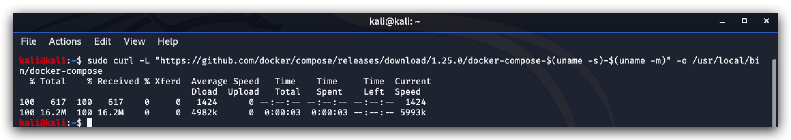

#   CHAPTER 1.1: Deploying Docker & Docker-Compose
>This chapter explains how to install ***Docker*** and ***Docker-Compose*** on your `Kali linux machine`

1.0 Installing Docker
====

|   |   |
|---|---|
|  | **Docker** container technology was launched in 2013 as an open source Docker Engine. It leveraged existing computing concepts around containers and specifically in the Linux world, primitives known as cgroups and namespaces. |
|   |   |

_"Containers are an abstraction at the app layer that packages code and dependencies together. Multiple containers can run on the same machine and share the OS kernel with other containers, each running as isolated processes in user space. Containers take up less space than VMs (container images are typically tens of MBs in size), can handle more applications and require fewer VMs and Operating systems."_

***Source: https://www.docker.com/products/docker-desktop*** 


On your kali linux machine open a terminal. Use SSH and login with your kali and password (kali/kali). First we're going to add the docker repository to our package repository on Kali.

```yml
 ssh kali@yourkalimachine
 ```
 
 ```yml
 curl -fsSL https://download.docker.com/linux/debian/gpg | sudo apt-key add -
```

```yml
 echo 'deb [arch=amd64] https://download.docker.com/linux/debian buster stable' | sudo tee /etc/apt/sources.list.d/docker.list
 ```

Next, let's install **docker community edition** and enable it as a service so it starts up automatically with the operating system.

```yml
 sudo apt-get update
 sudo apt-get install -y docker-ce
 sudo systemctl status docker
 sudo systemctl enable docker
```

Finally we're going to allow docker to run wih the current non-root user (kali).

```yml
sudo usermod -aG docker ${USER}
```
1.1 Installing Docker-Compose
====

|   |   |
|---|---|
|  | **Docker-compose** is a tool for defining and running multi-container Docker applications. |
|   |   |

_"We'll be using **docker-compose** files to deploy containers in most of our lab environment, so let's install docker-compose. With Compose, you use a YAML file to configure your application’s services. Then, with a single command, you create and start all the services from your configuration."_

***source: https://github.com/docker/compose***

> **Don't install docker-compose with "apt-get install"**, this is an old version of docker-compose. Use the instructions below to install the latest version (we're hardcoding the version for our training purposes so things don't break.) 

The following command downloads docker compose version 1.25.0 to the /usr/local/bin directory - which is in the default PATH.

```yml
sudo curl -L "https://github.com/docker/compose/releases/download/1.25.0/docker-compose-$(uname -s)-$(uname -m)" -o /usr/local/bin/docker-compose
```



Let's make this executable by adding the proper permissions to the file:

```yml
ls /usr/local/bin/docker-compose -lah
sudo chmod +x /usr/local/bin/docker-compose
docker-compose -version
```


Docker Cheat Sheet
====
docker image ls -a  
docker system prune -a  

BUILDING LOCAL IMAGES WITH DOCKER
====

``` 
docker build -t docker_mdbook:lean .
docker images
docker run -it --name mdbook_lean -v /Users/luks/_code/wiki:/opt/wiki -p4000:3000 docker_mdbook:lean
```
