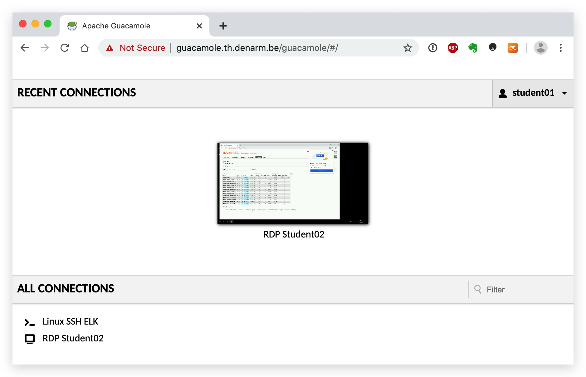
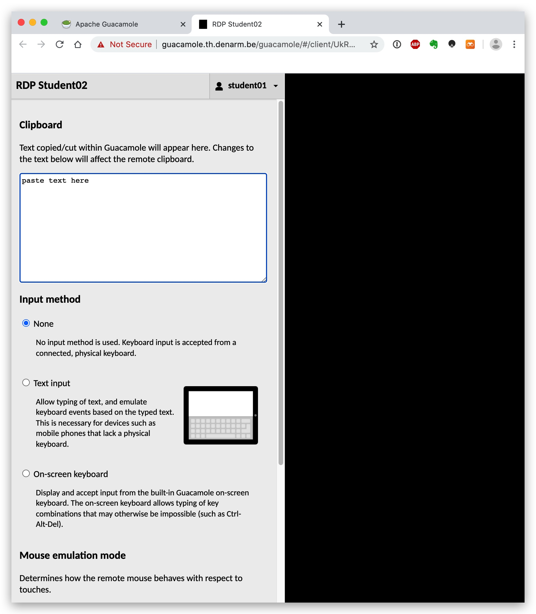
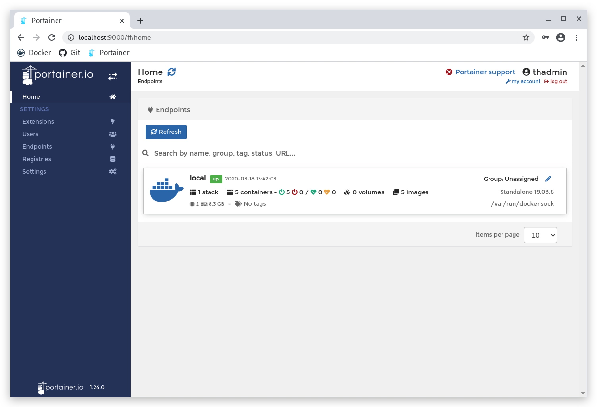
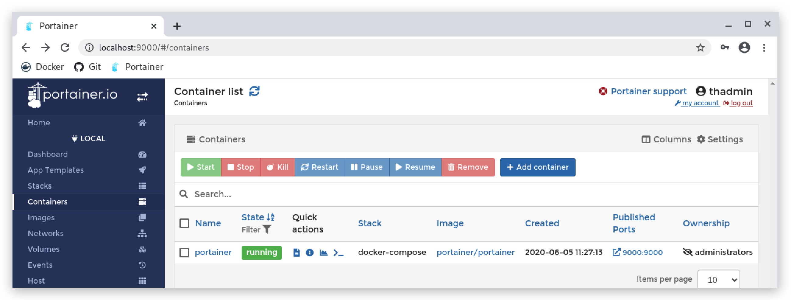

#   CHAPTER 1.2 - Installing Portainer
>This chapter explains how to install the Portainer on your `Kali linux machine`

_"With a GUI based tool like **Portainer CE**, you can leave the complex CLI commands behind and focus on delivering outstanding software. Portainer CE lets you skip up the learning curve and get your docker environments up and running quickly. Once you are up and running, Portainer CE gives you the tools (and the built-in knowledge of our experts) to keep your environments up."_


- SOURCE : ***[https://www.portainer.io/installation/](https://www.portainer.io/installation/)***

On your kali linux machine open a terminal. Use SSH and login with your kali username and password (***kali/kali***). 

> NOTE: If /opt/threathunt is not present, you might have to clone this manually. Normally in this training the machines should be provisioned with the necessary git repos and you can do a pull for the laytest updates. You can do a do a full clone like this:

```code
cd /opt
git clone https://github.com/crimsoncore/threathunt_student.git /opt/threathunt
```

In the ***/opt/threathunt/docker-compose*** directory you will find a docker-compose file to download an build portainer:

```code
cd /opt/threathunt/docker-compose
sudo docker-compose -f docker-compose.portainer.yml pull 
sudo docker-compose -f docker-compose.portainer.yml up -d
```
- -f : allows you to specify the filename of yor docker compose file (default is ***docker-compose.yml***)
- pull : means it will fetch the latest portainer image from dockerhub (in this case)
- -d : runs the command in daemon mode

```code
sudo nano /opt/threathunt/docker-compose/docker-compose.portainer.yml
```

```yml
version: '3'
services:
  portainer:
    image: portainer/portainer
    container_name: portainer
    restart: unless-stopped
    volumes:
    - /opt/threathunt/portainer/data:/data
    - /var/run/docker.sock:/var/run/docker.sock
    ports:
      - 9000:9000
    networks:
      - elastic
networks:
  elastic:
    driver: bridge
```

> NOTE: You cloned the threathunt repository to /opt/threathunt - this folder contains a default configuration for portainer with the username and password ***thadmin/PROVIDED_PASSWORD***. 


An alternative way of installing Portainer is just running a docker one-liner:

```code
docker volume create portainer_data
```
```code
docker run -d --name portainer -p 9000:9000 -v /var/run/docker.sock:/var/run/docker.sock -v portainer_data:/data portainer/portainer 
```
- **-d :** run as daemon
- **--name :** gives your container a chosen name (instead of a random one)
- **-p :** expose networks ports in the container - outside_host/inside_container
- **-v :** map a directory from the host to directory inside the container - outside_host/inside_container
  
Use your browser to connect to the ***[GUACAMOLE](https://guacamole.th.denarm.be/guacamole) server*** and select the __RDP StudentXX__ connection and login with your Student username and password ***(StudentXX/PROVIDED_PASSWORD)***. 

  

On your windows machine you can now open Chrome and browse to http://your_kali_ip:9000

> In Guacamole use CTRL-OPTION-SHIFT to get a copy paste window, paste your content here, then right-click in the windows poowershell or command prompt and your text will be pasted.





For this training we will be using Portainer as a simple GUI tool to manage our docker containers. You can of course also do this from the command line interface.

