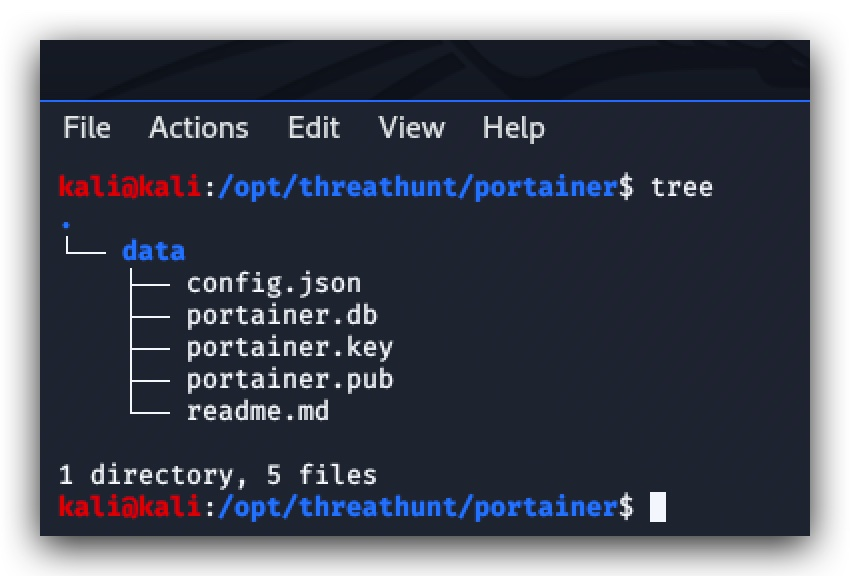

#   CHAPTER 1.2: Installing Portainer
>This chapter explains how to install the Portainer on your Kali linux machine

_"With a GUI based tool like **Portainer CE**, you can leave the complex CLI commands behind and focus on delivering outstanding software. Portainer CE lets you skip up the learning curve and get your docker environments up and running quickly. Once you are up and running, Portainer CE gives you the tools (and the built-in knowledge of our experts) to keep your environments up."_


***Source: https://www.portainer.io/installation/***

On your kali linux machine open a terminal. Use SSH and login with your kali username and password (***kali/kali***). In the ***/opt/threathunt/docker-compose*** directory you will find a docker-compose file to download an build portainer:

```code
cd /opt/threathunt/docker-compose
sudo docker-compose -f dc.portainer.yml up -d
```
***Source: /opt/threathunt/docker-compose/dc.portainer.yml***
```yml
version: '2'
services:
  portainer:
    image: portainer/portainer
    container_name: portainer
    restart: unless-stopped
    volumes:
    - /opt/threathunt/portainer/data:/data
    - /var/run/docker.sock:/var/run/docker.sock
    ports:
      - 9000:9000
    networks:
      - elastic
networks:
  elastic:
    driver: bridge
```

> NOTE: You cloned the threathunt repository to /opt/threathunt - this folder contains a default configuration for portainer with the username and password ***admin/portainer***. 



An alternative way of installing Portainer is just running a docker one-liner:

```code
docker volume create portainer_data
```
```code
docker run -d --name portainer -p 9000:9000 -v /var/run/docker.sock:/var/run/docker.sock -v portainer_data:/data portainer/portainer 
```
- **-d :** run as daemon
- **--name :** gives your container a chosen name (instead of a random one)
- **-p :** expose networks ports in the container - outside_host/inside_container
- **-v :** map a directory from the host to directory inside the container - outside_host/inside_container
  
