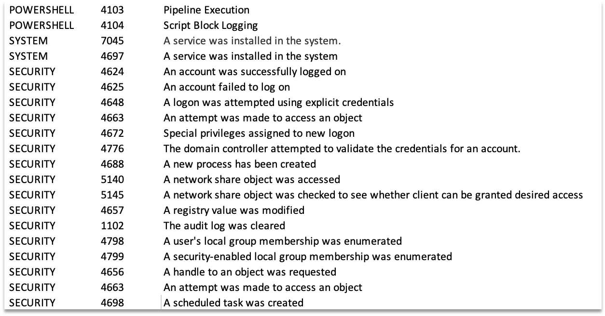
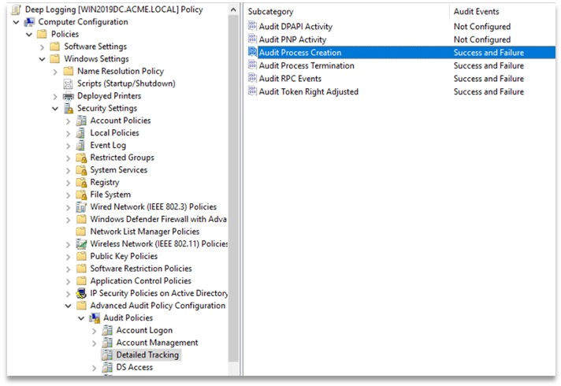
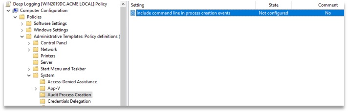
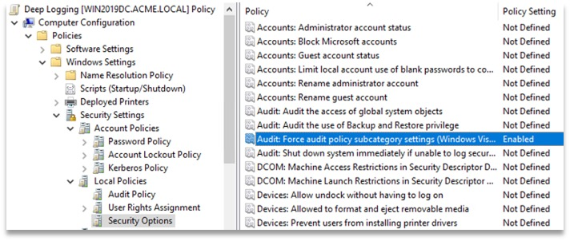
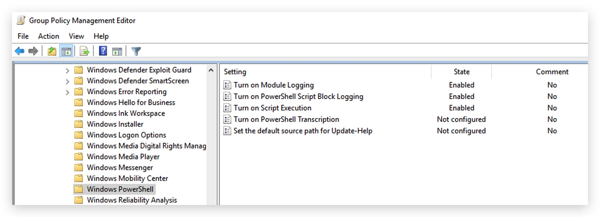
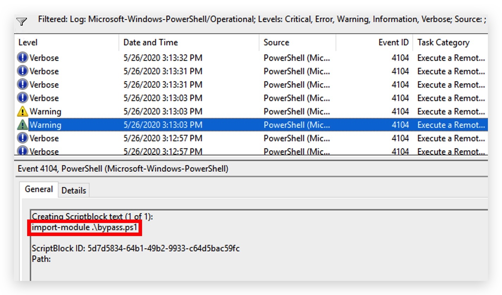
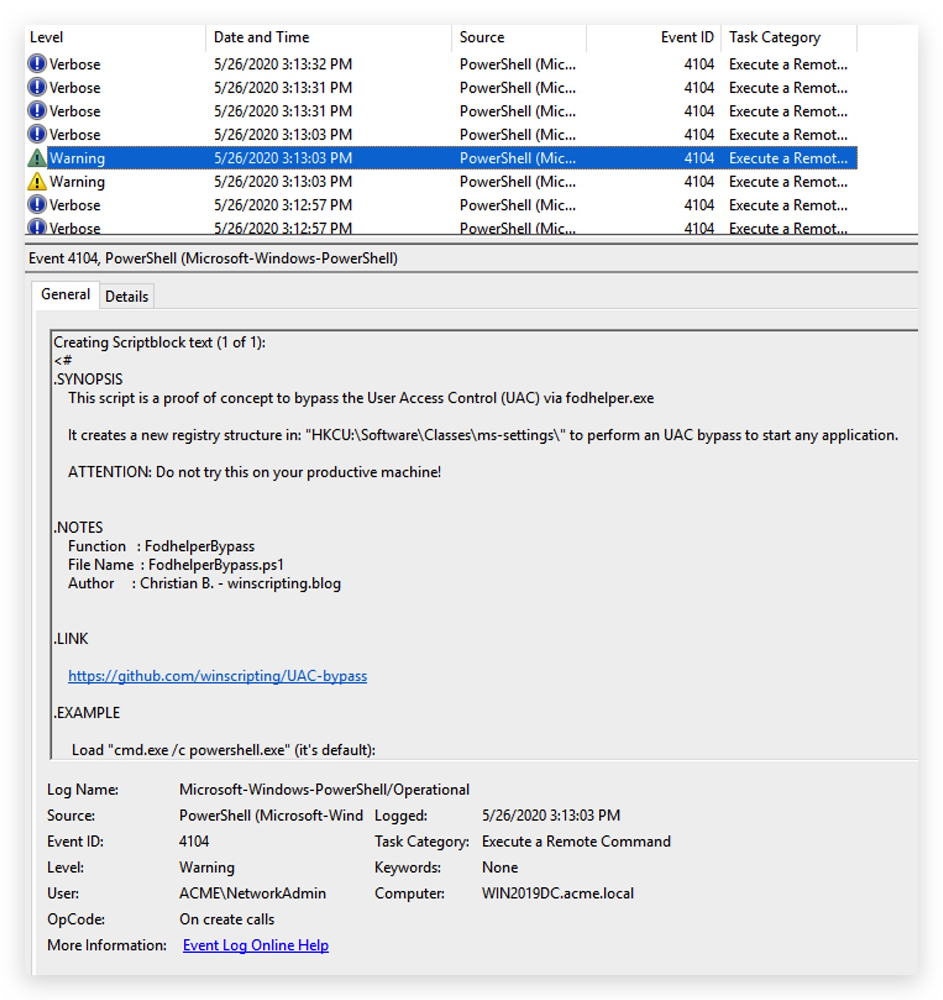
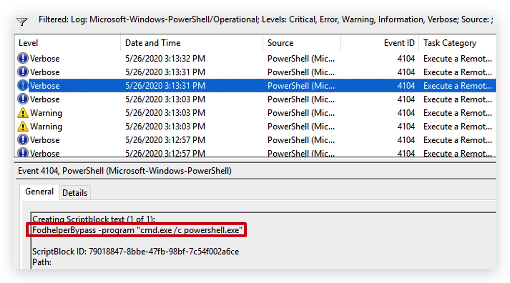
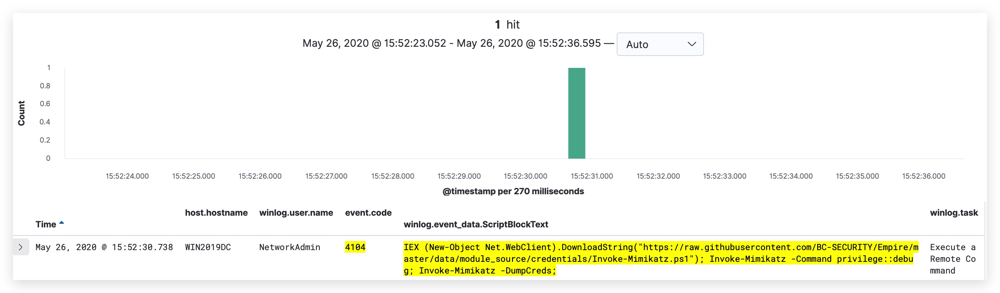
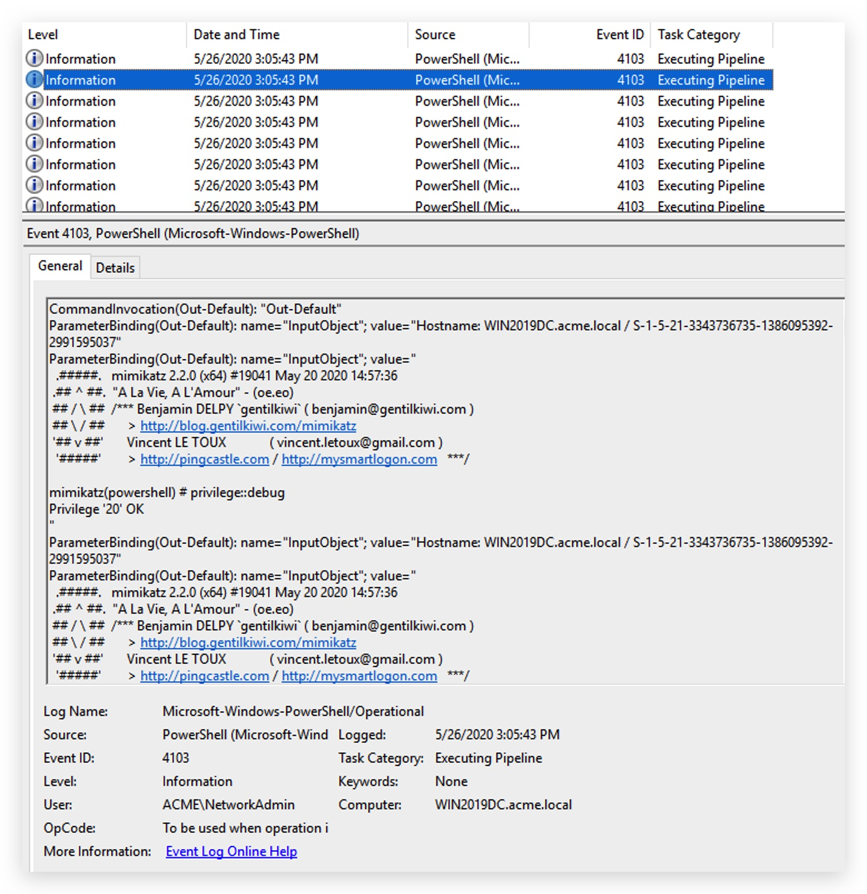

#   Chapter 1.3.4 - GPO's (Windows Endpoint)

All the policies below are already configured on the `Domain Controller` and are polled by all windows machines that join the domain.  

Here are a few examples on hpw to configure some key policies.

PROCESS LOGGING
====

> **LOG SOURCES**:
> - EventID **4688** - Audit Process Creation and Command Line Logging
> - Log : windows **security** eventlog
> - Collected on : **All Windows endpoints**
> - Reference : ***[https://www.ultimatewindowssecurity.com/securitylog/encyclopedia/event.aspx?eventID=4688](https://www.ultimatewindowssecurity.com/securitylog/encyclopedia/event.aspx?eventID=4688)***  

To enable **process creation** logging, go to _Computer Configuration\Windows Settings\Security Settings\Advanced Audit Policy Configuration\Audit Policies\Detailed Tracking_  
 - Double-click ***"Audit Process Creation"***
 - Check the box "***Configure the following audit events"***
 - Check the box ***"Success" and "Failure"***
  

Then enable the **command line arguments** logging by going to _Computer Configuration\Administrative Templates\System\Audit Process Creation_ 

- Double-click ***"Include command line in process creation events"*** and set to ***Enabled***

  

Finally when you use Advanced Audit Policy Configuration settings, you need to confirm that these settings are not overwritten by basic audit policy settings.

Go to _Computer Configuration\Policies\Windows Settings\Security Settings\Local Policies\Security Options_  
 - Double-click ***AUDIT***: ***"Force audit policy subcategory settings (Windows Vista or later) to override audit policy category settings"***, then click ***"Define this policy setting"*** and set to ***Enabled***

POWERSHELL LOGGING
====

> **LOG SOURCES**:
> - EventID **4103** - Powershell pipeline (module) logging
> - EventID **4104** - Powershell script block logging
> - Log : windows **windows-powershell** eventlog
> - Collected on : **All Windows endpoints**
> - Reference : 

enable **powershell** logging by going to _Computer Configuration\Administrative Templates\Windows Components\Windows Powershell_

When your windows clients pull down this GPO - they start logging verbose powershell events.  

Example of Event ID 4104 (script block logging):

**Script block logging** records blocks of code as they are executed by the PowerShell engine, thereby capturing the full contents of code executed by an attacker, including scripts and commands. Due to the nature of script block logging, it also records ***deobfuscated*** code as it is executed.

and in Kibana we can find this for example:

Example of Event ID 4103 (pipeline/module logging): 

***Module logging*** records pipeline execution details as PowerShell executes, including variable initialization and command invocations. Module logging will record portions of scripts, some de-obfuscated code, and some data formatted for output.

> module logging generates a large volume of events

