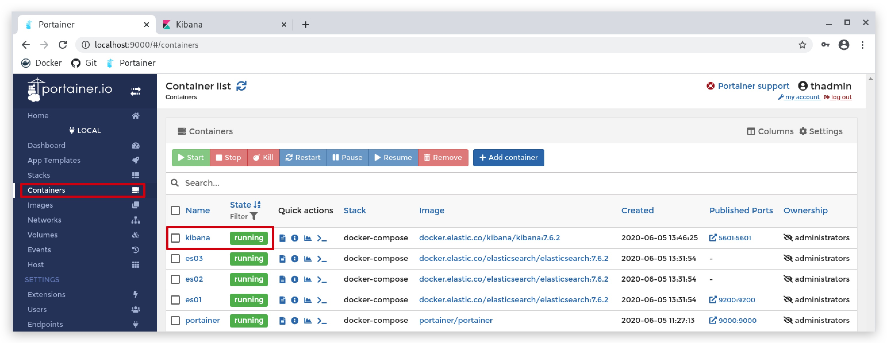
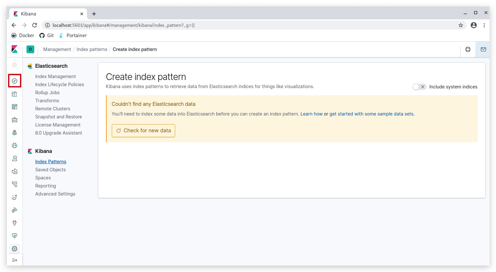

#   Chapter 1.6.3 - Kibana

INSTALL
====

After getting our Elastic cluster up and running w're now going to get Kibana (Our GUI) up and running>

```code
cd /opt/threathunt/docker-compose
cat docker-compose.kibana.yml
```

You can have a look at the docker-compose file:

```yaml 
version: '3'
services:
  kibana:
    image: 'docker.elastic.co/kibana/kibana:7.8.0'
    container_name: kibana
    restart: unless-stopped
    volumes:
      - /opt/threathunt/kibana/config/:/usr/share/kibana/config/
    ports:
      - '5601:5601'
    networks:
      - elastic
networks:
  elastic:
    driver: bridge
```

The Kibana configuration file (kibana.yml) is found under ***/opt/threathunt/kibana/config*** and points to your ***ES01*** node.  

```code
.  
├── config  
│   └── kibana.yml
└── dashboards 
    ├── export.ndjson  
    └── kibana_az_elk_export.ndjson  
```

```yaml
server.name: kibana
server.host: "0"
elasticsearch.hosts: [ "http://es01:9200" ]
```

To install the Kibana just run the following command:

```code
cd /opt/threathunt/docker-compose
sudo docker-compose -f docker-compose.kibana.yml up -d
```

This will create a Kibana docker container, called ***Kibana***. You can go to your [portainer](http://localhost:9000) and check the Kibana.



If all has gone well you can now use your browser and point it at http://localhost:5601.  

- Click on "***Explore on my own***"
- Then click on "***discover***" on the upper left corner.



There is no data in visible in Kibana yet, which is logical as we still need to ship logs first and have our Logstash node push those logs into our Elastic Index.