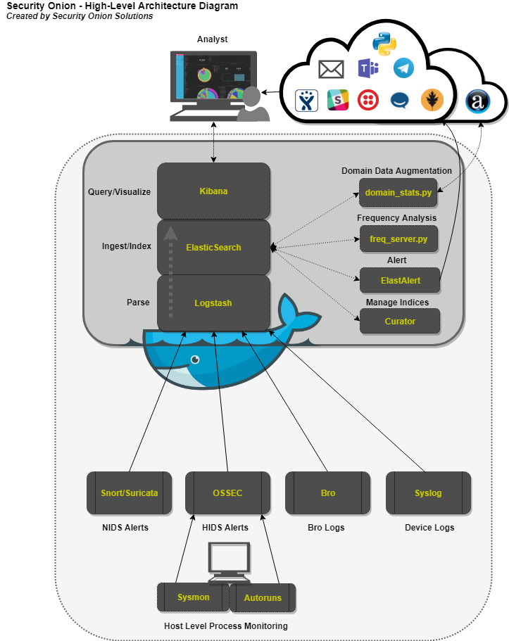

#   Chapter 1.4 - ELK

>This chapter explains how to install the complete ELK stack on your `Kali linux machine`

The screenshot below is a high level overview of the ***Security Onion*** stack, we will building our own stack and you will install and configure many of the components shown below.

- SOURCE : ***[https://securityonion.net](https://securityonion.net)***  

 