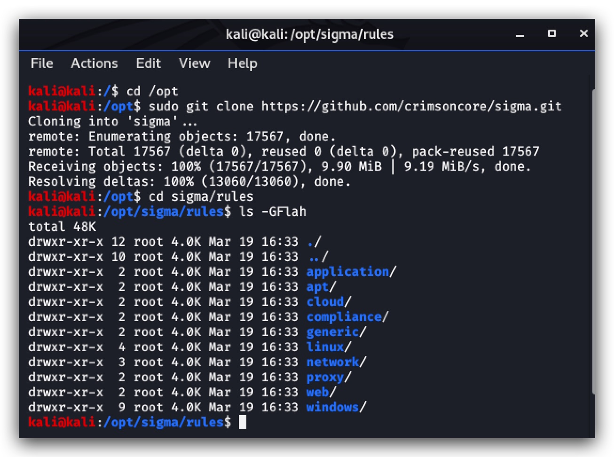

#   Chapter 1.4: Sigma
>This chapter explains how to install Sigma on your `Kali linux machine`

_"Sigma is a generic and open signature format that allows you to describe relevant log events in a straight forward manner. The rule format is very flexible, easy to write and applicable to any type of log file. The main purpose of this project is to provide a structured form in which researchers or analysts can describe their once developed detection methods and make them shareable with others."_


Installing Sigma
====
***source: https://github.com/Neo23x0/sigma***

Login to your `kali linux machine` with SSH and login with your kali username and password 

**Kali Username : thadmin**  
**Kali Password : Password1234!**


```code
ssh thadmin@yaz-kali-lsazure.westeurope.cloudapp.azure.com
``` 

First we're going to install sigma-tools using ***pip3*** 

```code
python3 -m pip install sigmatools
``` 

Then we'll clone the sigma rules from the ***crimsoncore/sigma.git*** repository this is a fork of the official repository and allows us to work on a more static code for this training.

```code
cd /opt
git clone https://github.com/crimsoncore/sigma.git
``` 


Working with Sigma
====

blacklist command