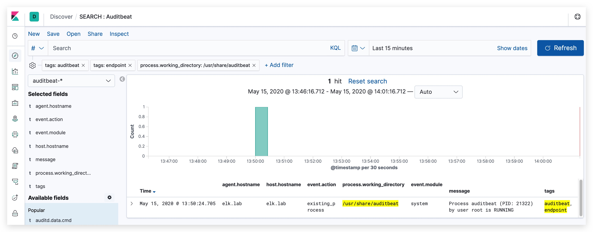

#   Chapter 1.7.3 - Auditbeat
>This chapter explains how to install the Auditbeat on your `Kali Linux Machine`, and ship logs to the RabbitMQ server.

***RabbitMQ*** is a message queue that is used in this class to collect all the students winlogbeat logs, through a logstash instance.

The pipeline looks like this:


From your Kali Linux Machine's Auditbeat Agent -> Logstash (on RabbitMQ server) -> RabbitMQ (on RabbitMQ server). Later on we will configure the student ELK servers to pull the logs from their queue.

- logstash listens on **TCP 5044**
- RabbitMQ listens on **TCP 5672**

```code
snippet
```

Connect with `GUACAMOLE SSH` to your Kali Linux, select the right student number that was assigned to you in the beginning of the class:

> **NOTE**: The username and password for the Guacamole server and the RDP connection your username __and__ password are studentxx. So if you are ***"student04"***, both your username and password for the windows machine will be ***"student04"***.

**Guacamole Username: StudentXX**  
**Guacamole Password : PROVIDED_PASSWORD**


USING AUDITBEAT
====

make sure your hostname is correct, Type the following command to edit /etc/hostname using nano or vi text editor:

```code
sudo nano /etc/hostname
```
Delete the old name and setup new name.  

Next Edit the /etc/hosts file:

```code
sudo nano /etc/hosts
```

Delete the old name and setup new name, and finally reboot the system.  

then let's install the auditbeat docker container

```code
cd /opt/threathunt/
git clone https://github.com/crimsoncore/docker_auditbeat.git
docker-compose -f dc.auditbeat.yml up
```

let's add a tag here that indicates this is an ___ENDPOINT___ log coming from ___AUDITBEAT___

```code
cd /opt/threathunt/auditbeat
nano auditbeat.yml
```

and add the following under the ***"General"*** section

> tags: ["auditbeat", "endpoint"]

if you make changes to your auditbeat.yml configuration file yoiu can restart auditbeat with:

```code
docker container restart auditbeat
docker container logs auditbeat --follow
```

and check the logs:

```code
docker container logs auditbeat --follow
```

> Don't forget to create `the auditbeat-*` Index in kibana

Now you can have a look at the Audibeat logs, filter on tags etc...




resources:  
https://kifarunix.com/install-and-configure-elastic-auditbeat-on-ubuntu-18-04/