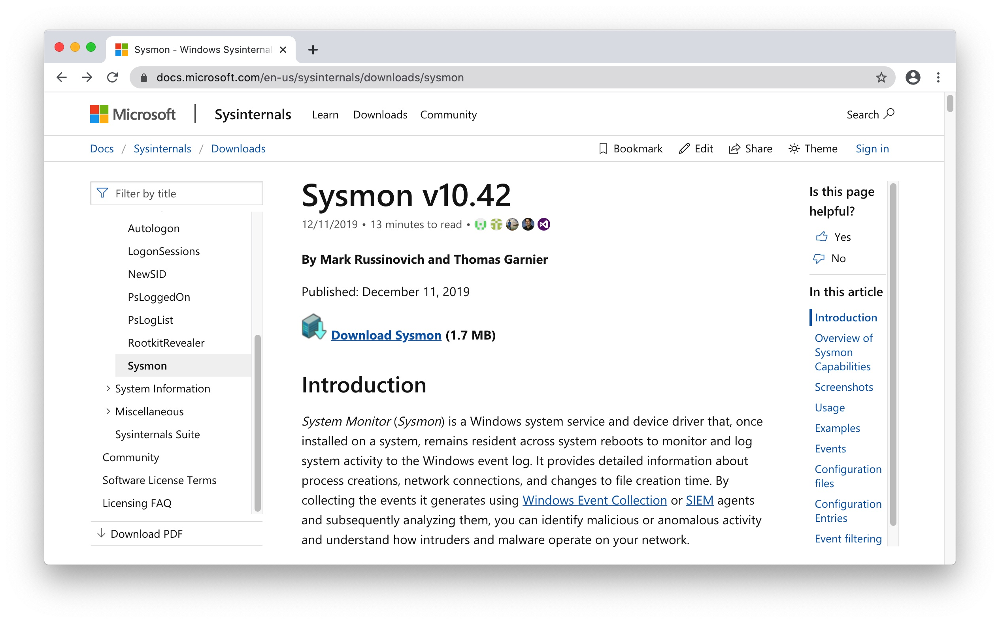
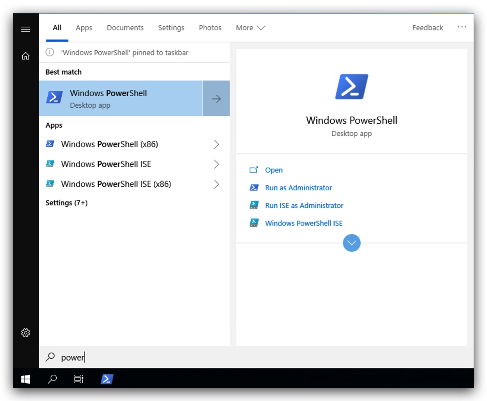
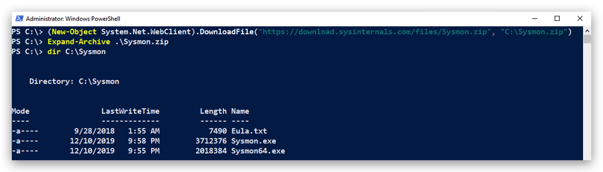
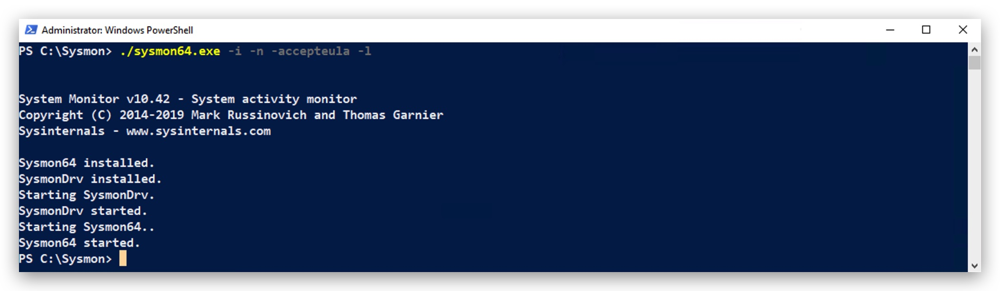
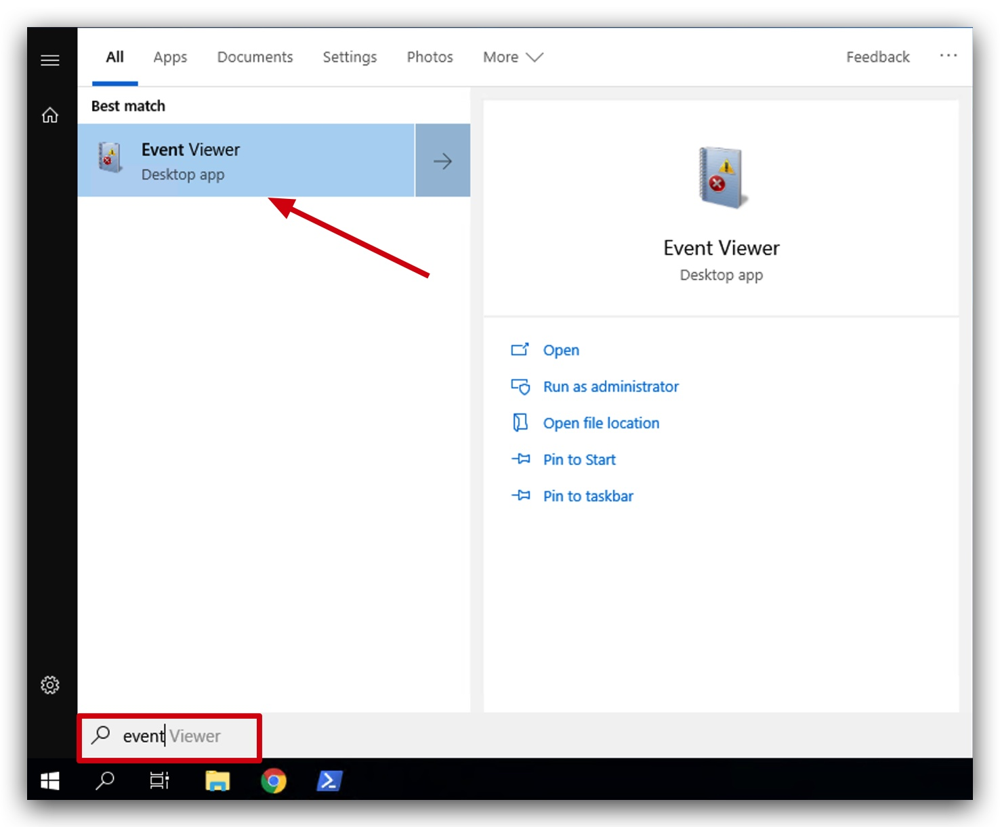
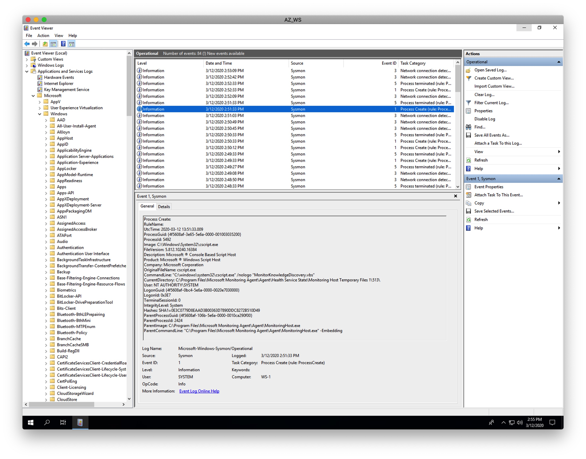
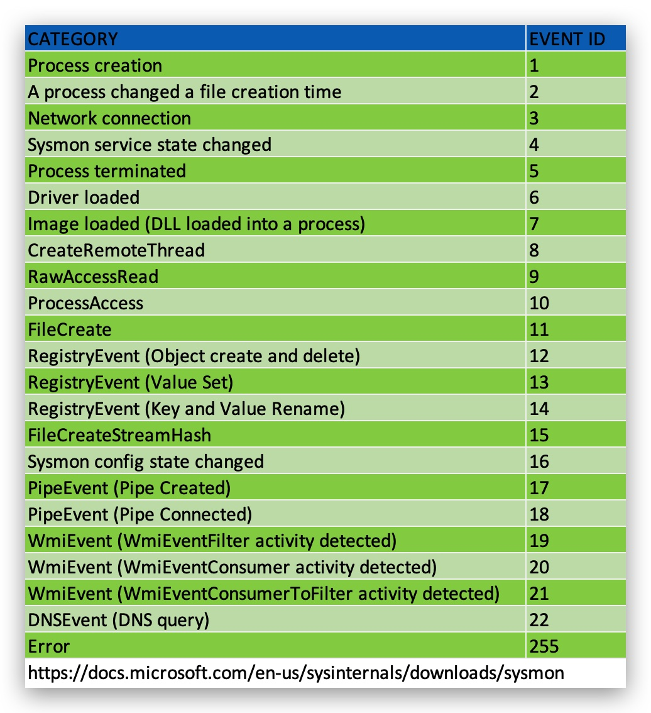

#   Chapter 1.5 - Sysmon

>This chapter explains how to install the Sysmon on your `Windows 10 Machine`

_"System Monitor (**Sysmon**) is a Windows system service and device driver that, once installed on a system, remains resident across system reboots to monitor and log system activity to the Windows event log. It provides detailed information about process creations, network connections, and changes to file creation time. By collecting the events it generates using Windows Event Collection or SIEM agents and subsequently analyzing them, you can identify malicious or anomalous activity and understand how intruders and malware operate on your network."_

>Note that Sysmon does not provide analysis of the events it generates, nor does it attempt to protect or hide itself from attackers.



***Source: https://docs.microsoft.com/en-us/sysinternals/downloads/sysmon*** 

Connect with `GUACAMOLE RDP` to your Windows 10 machine, select the right student number that was assigned to you in the beginning of the class:

> **NOTE**: The username and password for the Guacamole server are ***"thadmin" / "PROVIDED_PASSWORD"***. For the RDP connection you username __and__ password are studentxx. So if you are ***"student04"***, both your username and password for the windows machine will be ***"student04"***.

**Guacamole Username: thadmin**  
**Guacamole Password : PROVIDED_PASSWORD**


Then open a powershell prompt, download sysmon and unzip it to C:\Program Files\sysmon. You can ofcourse also simply download the file with your web browser and unzip the archive.

Let's start by opening powershell open your Windows 10 machine by clicking on the windows logo in the bottom left corner, and just start typing "power":



```code
mkdir C:\temp
(New-Object System.Net.WebClient).DownloadFile("https://download.sysinternals.com/files/Sysmon.zip", "C:\temp\Sysmon.zip")
Expand-Archive C:\temp\Sysmon.zip -DestinationPath "C:\program files\sysmon"
cd "C:\program files\sysmon"
dir
```

You will see the following:



Now let's install Sysmon, make sure your powershell or command prompt is elevated (running as administrator), and type the following:

```code
cd "C:\Program Files\sysmon"
./sysmon64.exe -i -n -accepteula -l
```


The following are command line parameters for sysmon:

>-n : log network connections  
-i : image loaded  
-h : create hash [md5,sha256,imphash]   
-l : loading of modules  
-c : configfile.xml  
-u : uninstall  

Once sysmon has been installed you can now open your windows event viewer by clicking on the windows logo in the bottom left corner, and just start typing "event"



 Nownavigate to ***Application and Services Logs > Microsoft > Windows > Symon > Operational***, you can now see that sysmon has created a new windows event log and is tracking process creations (**ID 1**), file creation time changes (**ID 2**),process terminations (**ID 5**), networks sessions (**ID 3**)and other activities. 

 

 If you pay close attention you will see that by default sysmon is not logging everything, that is because we didn't pass a configuration file when we installed sysmon

 
