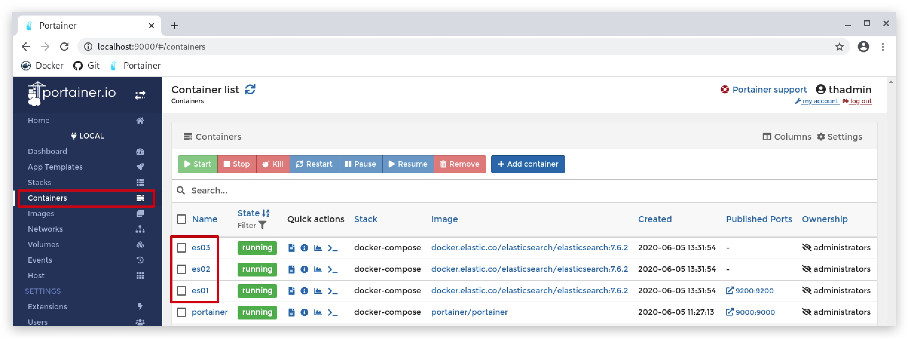

#   Chapter 1.6.1 - ELK


- SOURCE : ***[https://www.elastic.co/elasticsearch/](https://www.elastic.co/elasticsearch/)*** 

>Virtual memory - Elasticsearch uses a mmapfs directory by default to store its indices. The default operating system limits on mmap counts is likely to be too low, which may result in out of memory exceptions.

On your `Kali linux machine` do the following

```code
sudo bash -c 'echo "vm.max_map_count=262144" >> /etc/sysctl.conf'
sudo sysctl -p
sysctl vm.max_map_count
```
INSTALL
====

We're going to install Elastic first, as a 3 node cluster running in docker containers:

```code
cd /opt/threathunt/docker-compose
cat docker-compose.elastic.yml
```

You can have a look at the docker-compose file:

```code
version: '3'
services:
  es01:
    image: docker.elastic.co/elasticsearch/elasticsearch:7.8.0
    container_name: es01
    restart: unless-stopped
    environment:
      - node.name=es01
      - cluster.name=es-docker-cluster
      - discovery.seed_hosts=es02,es03
      - cluster.initial_master_nodes=es01,es02,es03
      - bootstrap.memory_lock=true
      - "ES_JAVA_OPTS=-Xms512m -Xmx512m"
    ulimits:
      memlock:
        soft: -1
        hard: -1
    volumes:
      - data01:/usr/share/elasticsearch/data
    ports:
      - 9200:9200
    networks:
      - elastic
  es02:
    image: docker.elastic.co/elasticsearch/elasticsearch:7.8.0
    container_name: es02
    restart: unless-stopped
    environment:
      - node.name=es02
      - cluster.name=es-docker-cluster
      - discovery.seed_hosts=es01,es03
      - cluster.initial_master_nodes=es01,es02,es03
      - bootstrap.memory_lock=true
      - "ES_JAVA_OPTS=-Xms512m -Xmx512m"
    ulimits:
      memlock:
        soft: -1
        hard: -1
    volumes:
      - data02:/usr/share/elasticsearch/data
    networks:
      - elastic
  es03:
    image: docker.elastic.co/elasticsearch/elasticsearch:7.8.0
    container_name: es03
    restart: unless-stopped
    environment:
      - node.name=es03
      - cluster.name=es-docker-cluster
      - discovery.seed_hosts=es01,es02
      - cluster.initial_master_nodes=es01,es02,es03
      - bootstrap.memory_lock=true
      - "ES_JAVA_OPTS=-Xms512m -Xmx512m"
    ulimits:
      memlock:
        soft: -1
        hard: -1
    volumes:
      - data03:/usr/share/elasticsearch/data
    networks:
      - elastic
volumes:
  data01:
    driver: local
  data02:
    driver: local
  data03:
    driver: local
networks:
  elastic:
    driver: bridge
```

To install the 3 nodes just run the following command:

```code
cd /opt/threathunt/docker-compose
sudo docker-compose -f docker-compose.elastic.yml up -d
```

This will create 3 elastic nodes in docker containers, called ***ES01***, ***ES02*** and ***ES03***. You can go to your [portainer](http://localhost:9000) and check the nodes.



Index aliases
----

```code
PUT /winlogbeat-*/_alias/all_logs  
PUT /logstash-*/_alias/all_logs  
GET /_cat/aliases  
```

```yml
POST /_aliases?pretty
{
    "actions" : [
        { "remove" : { "index" : "winlogbeat-*", "alias" : "alias1" } }
    ]
}
```

Winlogbeat templates:
----

.\winlogbeat.exe export template --es.version 7.8.0 | Out-File -Encoding UTF8 winlogbeat.template.json  
Invoke-RestMethod -Method Put -ContentType "application/json" -InFile winlogbeat.template.json -Uri http://localhost:9200/_template/winlogbeat-7.8.0

https://www.elastic.co/guide/en/beats/winlogbeat/current/winlogbeat-template.html


----

curl -XDELETE localhost:9200/logstash-alsid*