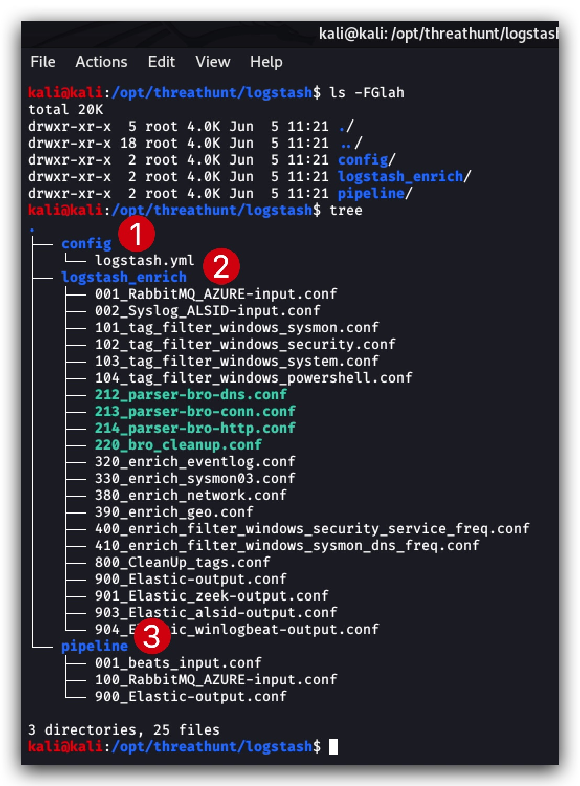
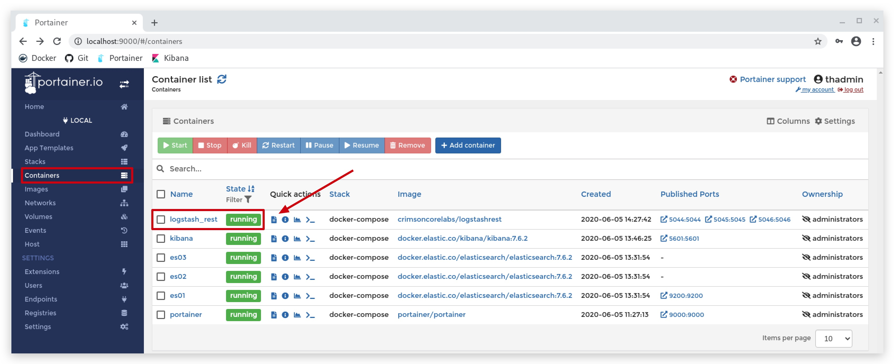
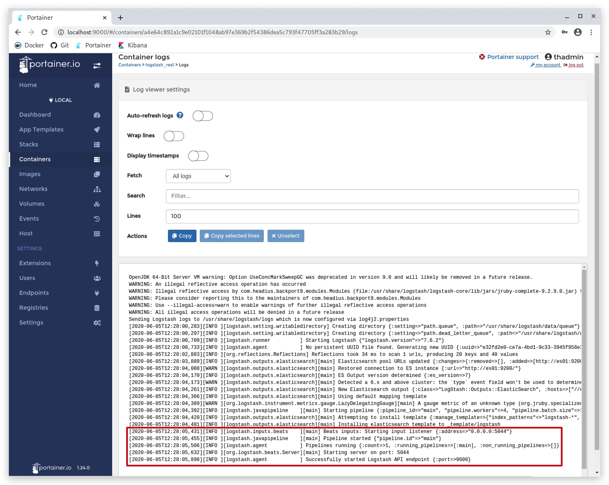

#   Chapter 1.6.2 - Logstash

>This chapter explains how to install Logstash on your `Kali linux machine`


The Logstash Pipeline
=====

```code
cd /opt/threathunt/logstash
```

You will find 3 directories here  



1. config holds the logstash.yml file which for this lab we won't be using. You could for example configure ***[multiple pipelines](https://www.elastic.co/guide/en/logstash/current/multiple-pipelines.html)*** here.

2. logstash_enrich holds some input, filter and output scripts that we can use as examples - they are __not__ active in the configuration.  

3. the ***pipeline*** folder holds all the scripts for 
    - Logstash inputs for accepting logs, you can look at these as a listener on a specific TCP/UDP port.
    - Filters allow you to manipulate logs that come in, you can enrich logs, add/remove fields etc etc..
    - Outputs will forward the logs to an ELastic Index, Logstash instance or Message Queue - we will be doing forwarding logs to a logstash instance that on its turn forwards all students logs to a RabbitMQ server.

> The order of these scripts is important, they will be processed in order!

INPUTS
====
For the lab, the set up is as follows:

Windows clients (***winlogbeat agent***) --push-to--> central Logstash --push-to--> `central RabbitMQ`  

Student Kali Linux machines with ELK (***logstash***) --pull-from--> `central RabbitMQ` 

So this means your client machines will be forwarding their logs to a central Logstash server (managed and configure by the instructors), so you will not be forwarding your logs to your __own__ logstash. You logstash ***INPUT*** will fetch all the students logs from the RabbitMQ server. 

> __IMPORTANT__ :  
> Change the __password__ in the config file below with the ***PROVIDED_PASSWORD***  
> Change the __queue__ to your student number : for example RabbitQueue_StudentXX -> ***RabbitQueue_Student02***

```code
cd /opt/threathunt/logstash/pipeline
nano 100_RabbitMQ_AZURE-input.conf
```

```yml
input {
    rabbitmq {
        host => "10.0.0.6"
        port => 5672
        user => "thadmin"
        password => "PROVIDED_PASSWORD"
        queue => "RabbitQueue_StudentXX"
        passive => true
        exclusive => false
        durable => true
        auto_delete => false
        subscription_retry_interval_seconds => 3
        threads => 2
	prefetch_count => 256
    }
}
```

FILTERS
====

For now we're not going to put any filters, we will do this later on when we start enriching our logs.


OUTPUTS (Already pre-configured)
====

The examle below is using a ___tag___ that we defined in our ***winlogbeat agent***, this can be done in the logstash filters as well. We will configure the logging agents in the next chapter, just keep this in mind. The index name is derived from metadata provided by the winlogbeat agent as well

```code
cd /opt/threathunt/logstash/pipeline
nano 900_Elastic-output.conf
```

> You don't need to make changes to this file.

```yml
output {
  if "windows" in [tags] {
    elasticsearch {
      hosts => "es01:9200"
      index => "%{[agent][type]}-%{[agent][version]}-%{+YYYY.MM.dd}"
    }
  }
}
```

INSTALL
====

We're going to install Logstash running in a docker container:

```code
cd /opt/threathunt/docker-compose
cat docker-compose.logstash.yml
```

You can have a look at the docker-compose file:

```yml
version: '3'
services:
  logstash:
    image: crimsoncorelabs/logstashrest
    container_name: logstash_rest
    ports:
     - 5044:5044
     - 5045:5045
     - 5046:5046
    restart: unless-stopped
    volumes:
    - /opt/threathunt/logstash/pipeline/:/usr/share/logstash/pipeline/
    - /opt/threathunt/logstash/config/logstash.yml:/usr/share/logstash/config/logstash.yml
    - /opt/threathunt/logstash/patterns:/usr/share/logstash/patterns
    - /opt/threathunt/logstash/pki/:/usr/share/logstash/pki
    networks:
      - elastic
networks:
  elastic:
    driver: bridge
```

To install the Logstash just run the following command:

```code
cd /opt/threathunt/docker-compose
sudo docker-compose -f docker-compose.logstash.yml up -d
```

This will create a logstash node in docker, called ***logstash_rest***. You can go to your [portainer](http://localhost:9000) and check the container.



Click on the little "log" icon to the right of the green "running" label - this will show you if logstash is propely running.

