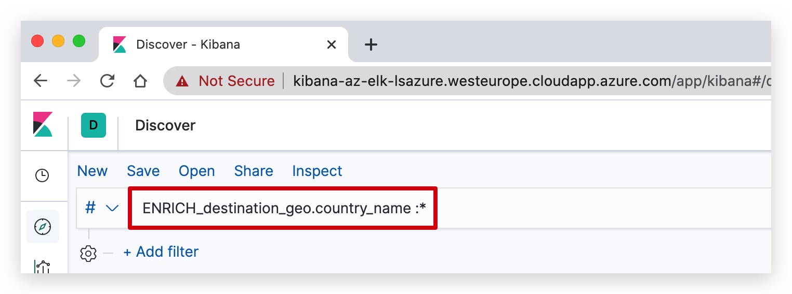
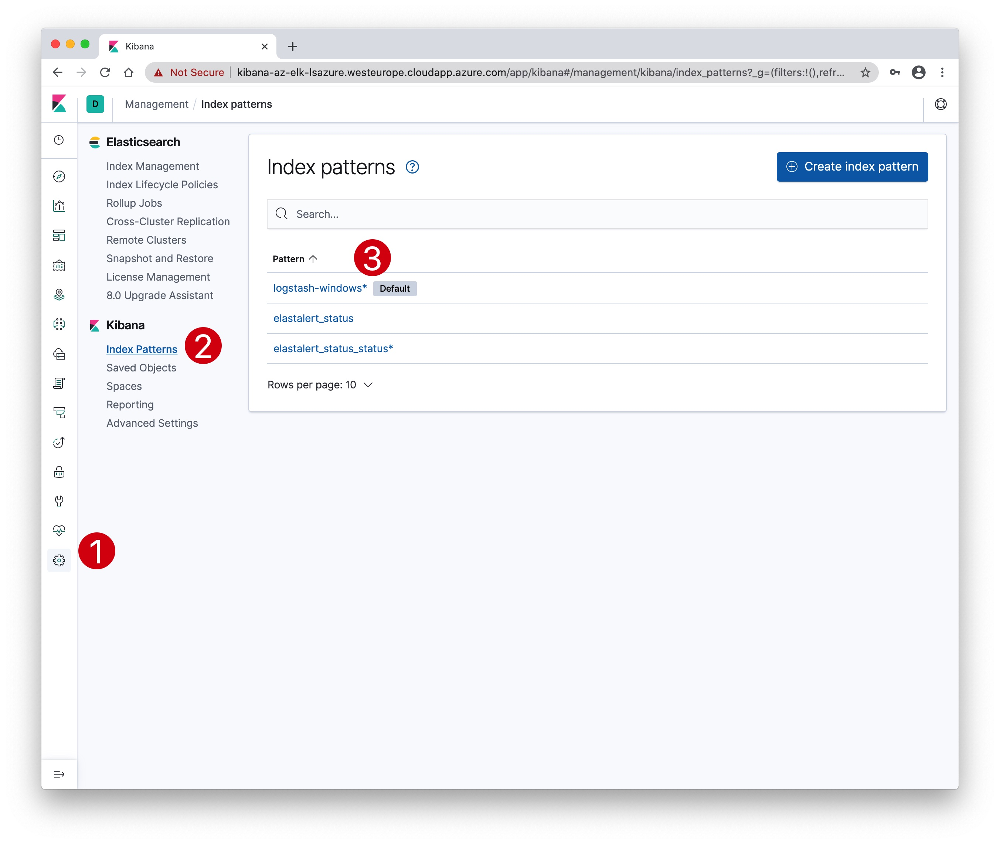
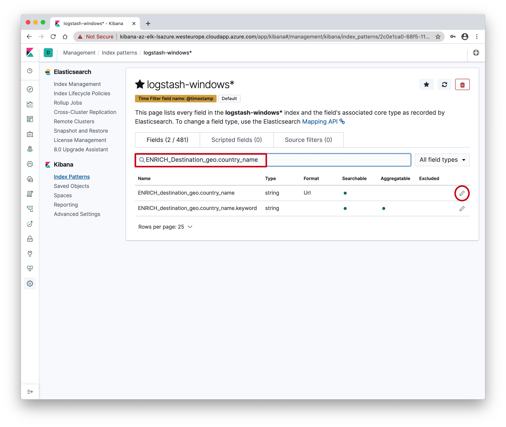
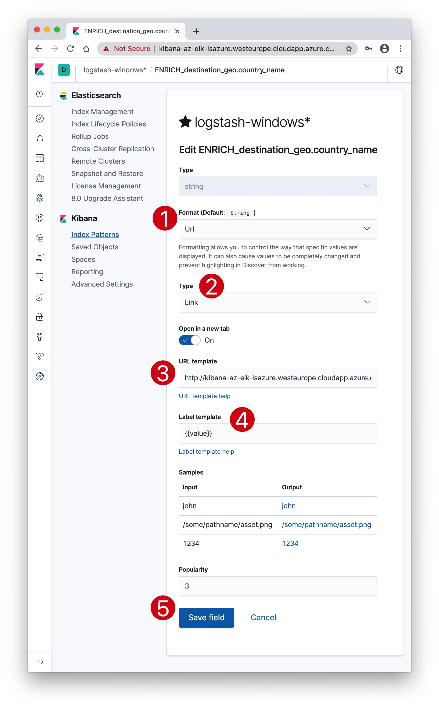
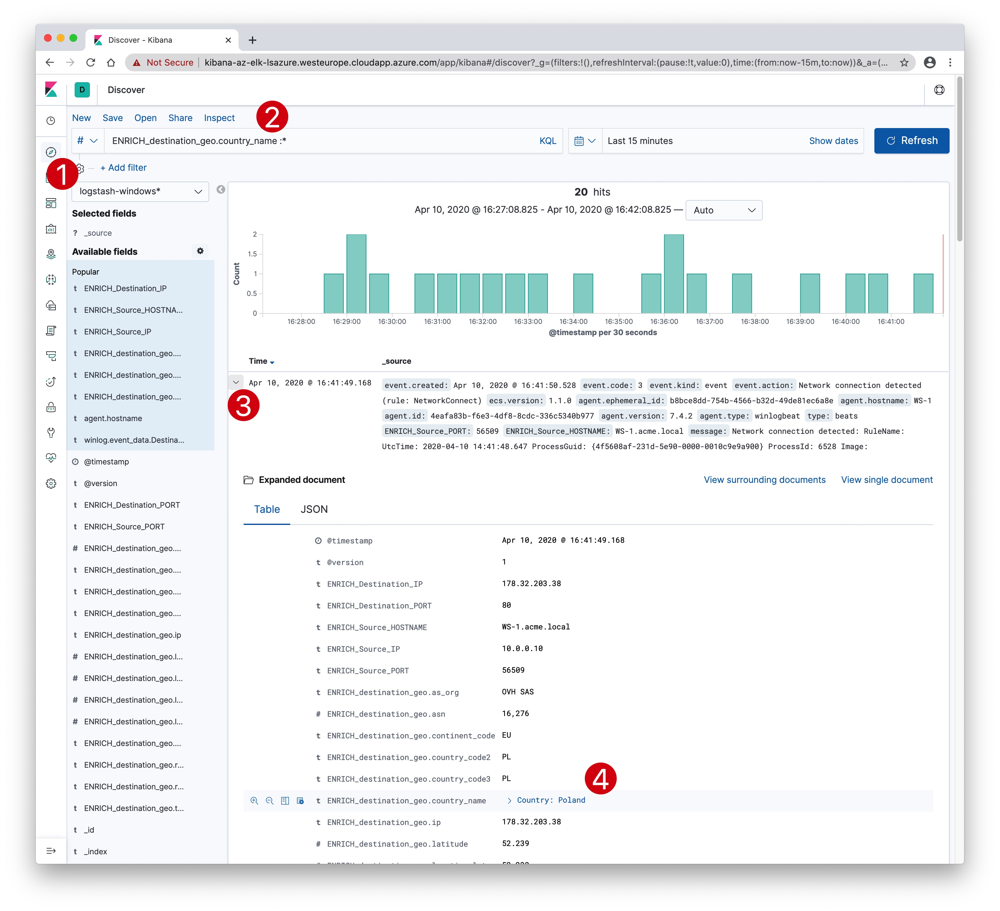
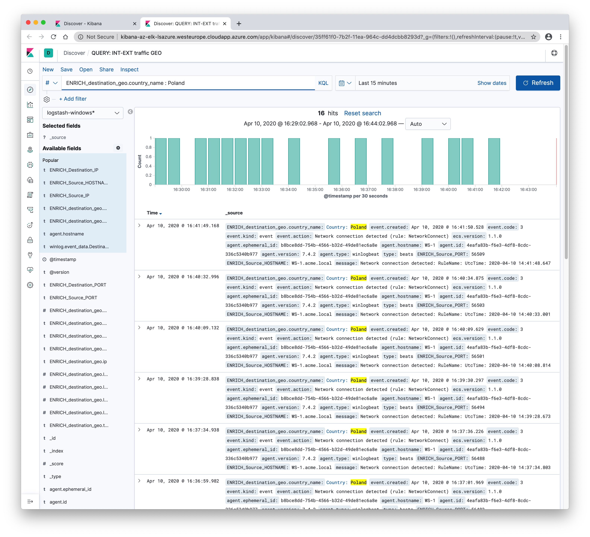

#   Chapter 1.8.2 - Kibana Views

Clickable links in Kibana
====

In your Kibana:  
Make a new query for the field you want to make into a drill-down hyperlink, in this example we are going to make the country name field into a clickable link.  



From your browser search bar you can now copy the URL, it will look something like this:


```code
http://kibana-az-elk-lsazure.westeurope.cloudapp.azure.com/app/kibana#/discover?_g=(filters:!(),refreshInterval:(pause:!t,value:0),time:(from:now-15m,to:now))&_a=(columns:!(_source),index:'2c0e1ca0-68f5-11ea-84ab-f5c320c83779',interval:auto,query:(language:kuery,query:'ENRICH_destination_geo.country_name%20:%20*'),sort:!(!('@timestamp',desc)))
```
Copy this search query and change the ***"asterisk"*** with `{{value}}`: Your query should look like this:

```code
http://kibana-az-elk-lsazure.westeurope.cloudapp.azure.com/app/kibana#/discover?_g=(filters:!(),refreshInterval:(pause:!t,value:0),time:(from:now-15m,to:now))&_a=(columns:!(_source),index:'2c0e1ca0-68f5-11ea-84ab-f5c320c83779',interval:auto,query:(language:kuery,query:'ENRICH_destination_geo.country_name%20:%20{{value}}'),sort:!(!('@timestamp',desc)))  
```

In your Kibana:

1. Click on ***"Management"***, the little cogs in the left bottom corner,
2. then click on ***"Index Patterns"***,
3. and finally click on ***"Winlogbeat-*"***




Look for the `ENRICH_destination_geo.country_name` field and click on edit (the little pencil on the right).



1. Click on ***"Format"***, and select `Url`,
2. then click on ***"Type"***, select `Link`,
3. in the ***"URL Template"*** paste your adapted link in this field, it has the `{{value}} filed instead of the ***"asterisk"***

```code
http://kibana-az-elk-lsazure.westeurope.cloudapp.azure.com/app/kibana#/discover?_g=(filters:!(),refreshInterval:(pause:!t,value:0),time:(from:now-15m,to:now))&_a=(columns:!(_source),index:'2c0e1ca0-68f5-11ea-84ab-f5c320c83779',interval:auto,query:(language:kuery,query:'ENRICH_destination_geo.country_name%20:%20{{value}}'),sort:!(!('@timestamp',desc)))  
```
4. in the ***"Label Template"*** enter a short name, for example : `Country: {{value}}`



5. Click ***"save"***  
   
Let's launch our query again:  

1. go back to ***"Discover"***, the little compass in the upper left corner.
2. enter your search query `ENRICH_destination_geo.country_name : *`
3. open one of the events
4. you will now see the country is clickable



Clicking on this link will launch a query in a new tab for that specific country - as seens below.

