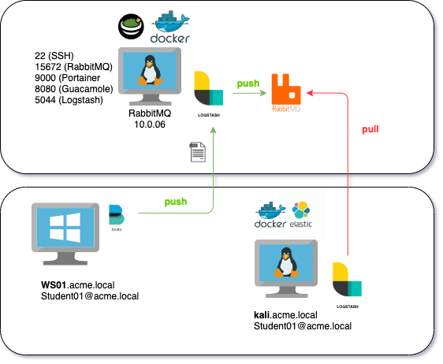
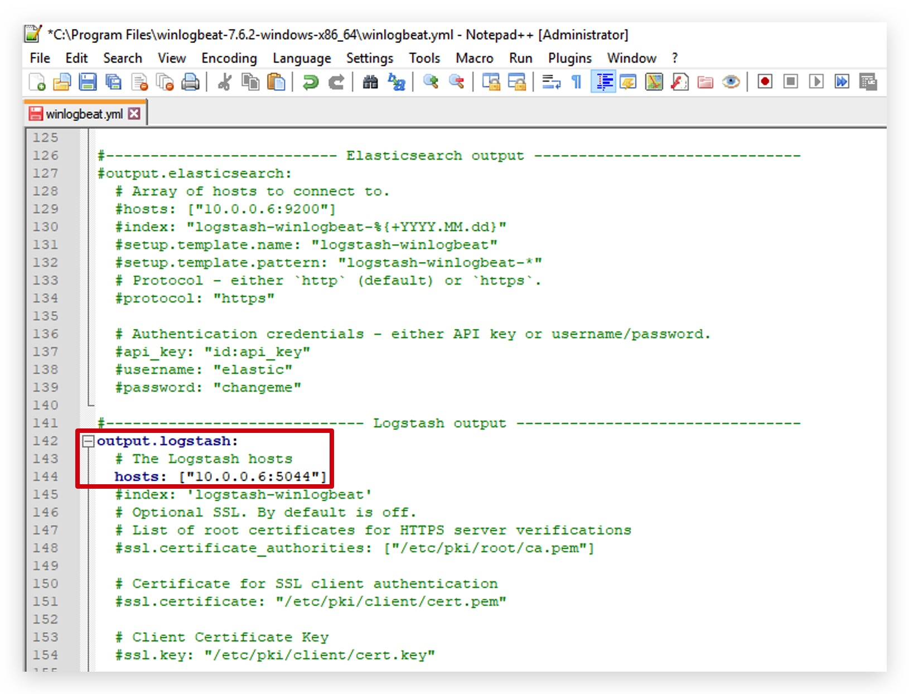
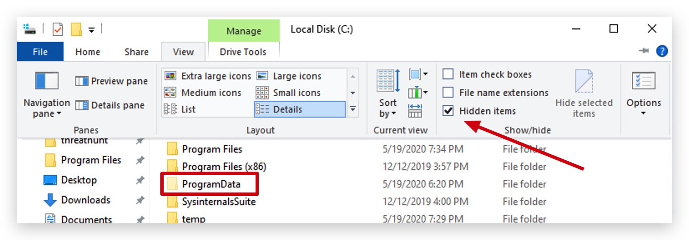
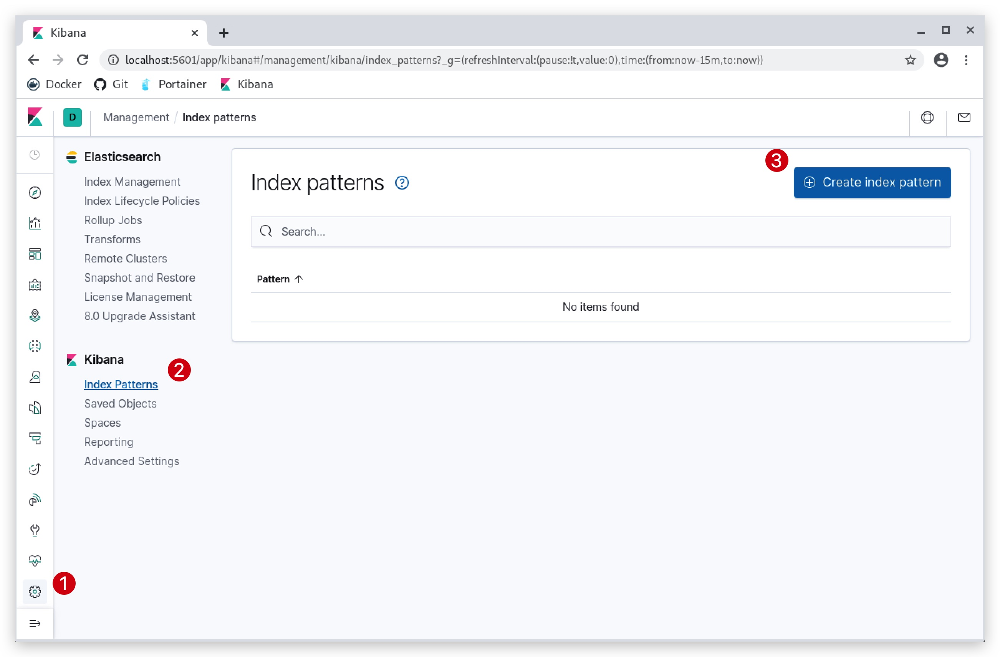
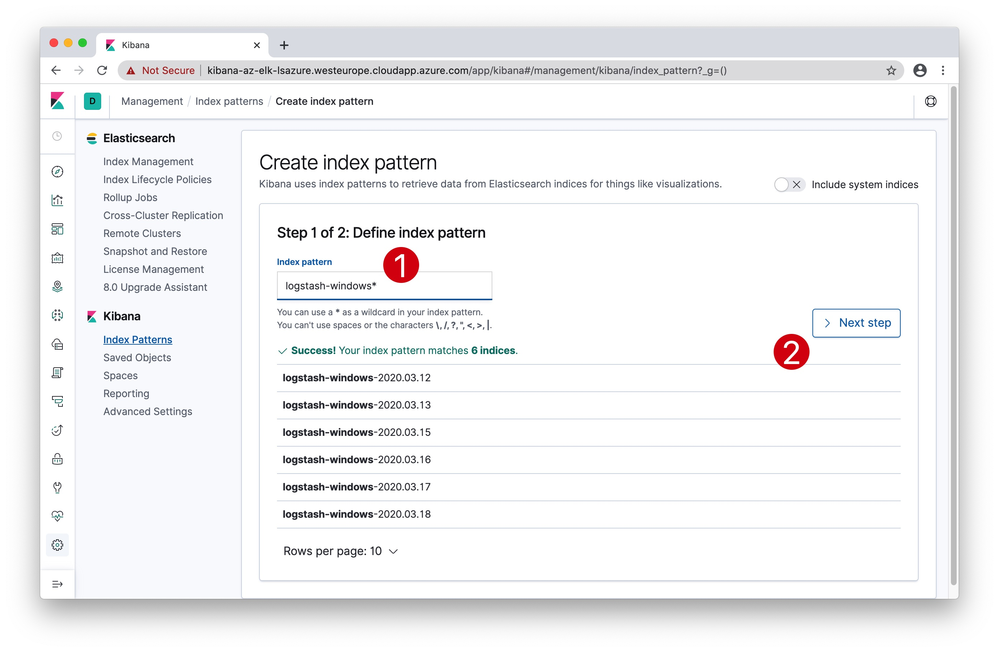
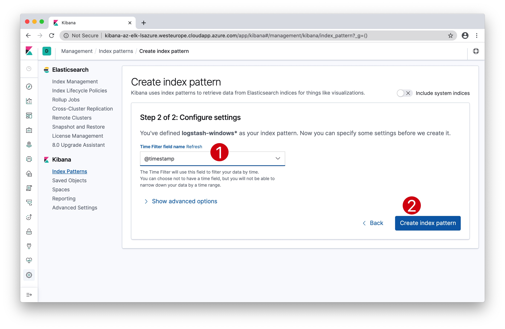
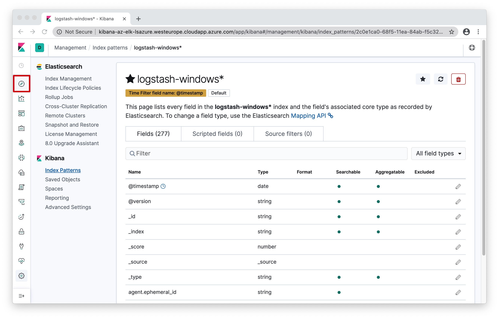
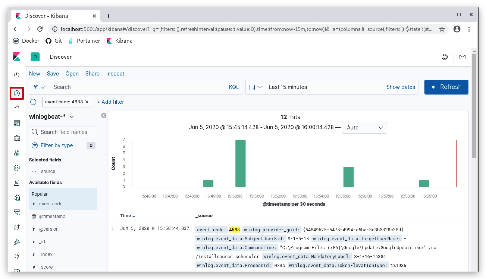
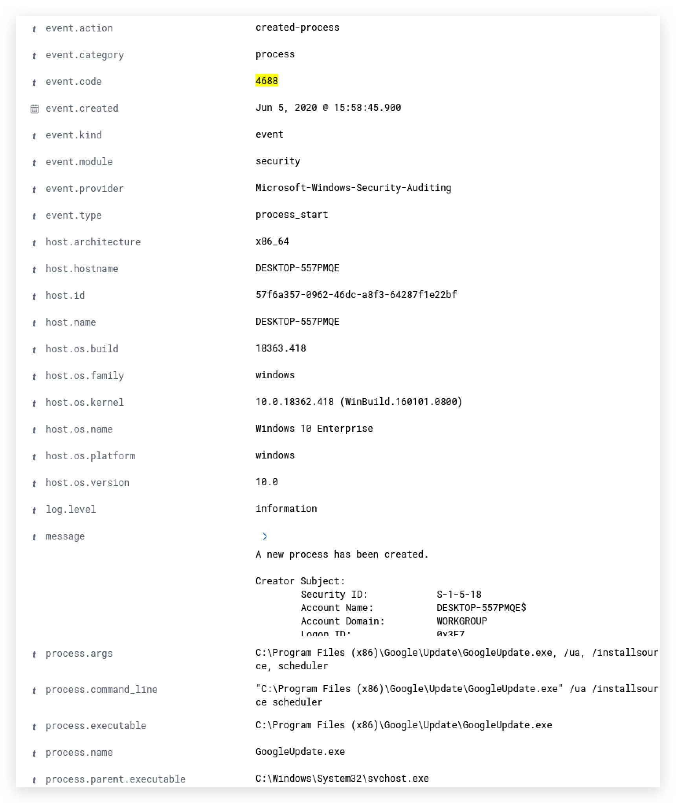
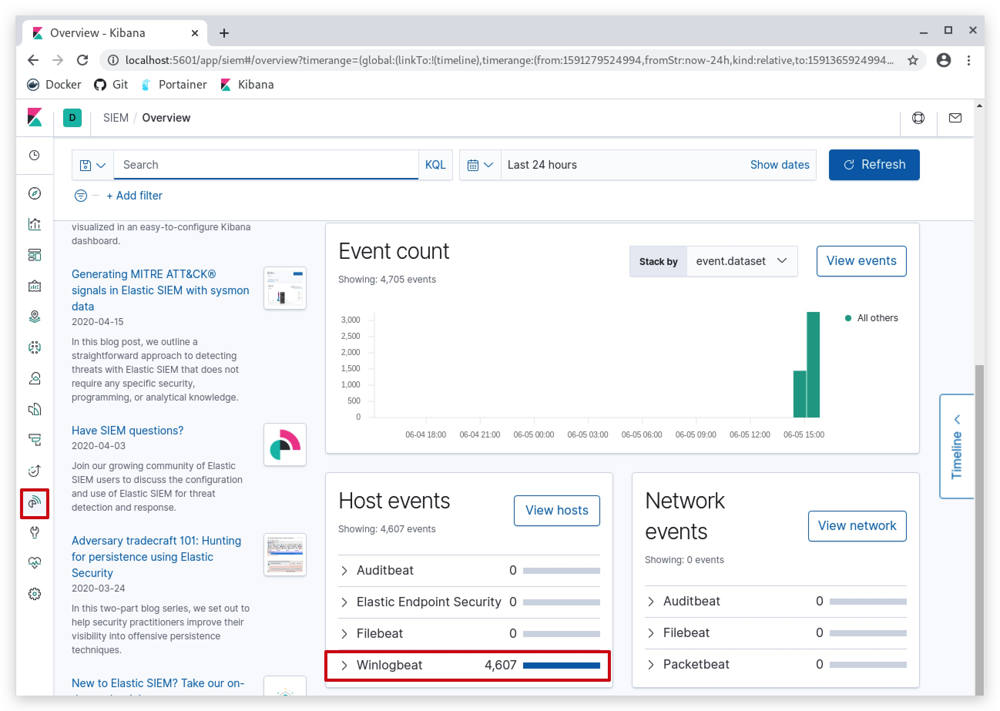

#   Chapter 1.7 - Winlogbeat
>This chapter explains how to install the Winlogbeat on your `Windows 10 Machine`, and ship logs to the RabbitMQ server.

***RabbitMQ*** is a message queue that is used in this class to collect all the students winlogbeat logs, through a logstash instance.

The pipeline looks like this:



From your Windows 10 Machine's Winlogbeat Agent -> Logstash (on RabbitMQ server) -> RabbitMQ (on RabbitMQ server). Later on we will configure the student ELK servers to pull the logs from their queue.

- logstash listens on **TCP 5044** on 10.0.0.6
- RabbitMQ listens on **TCP 5672** on 10.0.0.6

1.0 - "DOWNLOAD winlogbeat"
===

Let's start by opening powershell open your Windows 10 machine by clicking on the windows logo in the bottom left corner, and just start typing "power":


open powershell and run as ___administrator___:

```code
mkdir c:\temp
(New-Object System.Net.WebClient).DownloadFile("https://artifacts.elastic.co/downloads/beats/winlogbeat/winlogbeat-7.6.2-windows-x86_64.zip", "C:\temp\winlogbeat-7.6.2-windows-x86_64.zip")
Expand-Archive C:\temp\winlogbeat-7.6.2-windows-x86_64.zip -DestinationPath "C:\program files\"
cd "C:\program files\winlogbeat-7.6.2-windows-x86_64"
dir
```

1.1 - "VERIFY the winlogbeat configuration"   
===

We already provided are preconfigured winlogbeat.yml file, located under "C:\threathunt\labsetup\", copy that file to "C:\program files\winlogbeat-7.6.2-windows-x86_64" and verify that the configuration is pointing to the central Logstash/RabbitMQ:

```code
cp 'C:\threathunt\labsetup\winlogbeat.yml' 'C:\Program Files\winlogbeat-7.6.2-windows-x86_64\'
```

use notepad++ to edit the winlogbeat.yml file, and let's make sure the config file is correct, edit the ***winlogbeat.yml*** and check that the Logstash output is uncommented and pointing to the RabbitMQ server's (10.0.0.6:5044) Logstash instance:

  

1.2 - "LOAD Elasticsearch templates"   
===

If Winlogbeat has a direct connection and is using Elasticearch as the output, it will automatically load the template. However, if you are using Logstash as the output, you need to manually load the Elasticsearch template. See example command to load the Elasticsearch template manually below:

Before installing and starting the agent - we need to make sure that ***Elastic SIEM*** has the right mappings for the index.

```code
.\winlogbeat.exe setup --index-management -E output.logstash.enabled=false -E 'output.elasticsearch.hosts=["yourkalimachine:9200"]'
```

1.3 - "INSTALL winlogbeat"  
===

Finally install winlogbeat, use powershell copy the following command.

```code
cp C:\threathunt\labsetup\winlogbeat.yml 'C:\Program Files\winlogbeat-7.6.2-windows-x86_64\'
.\install-service-winlogbeat.ps1
start-service winlogbeat
get-service winlogbeat
```

> You can check the logs in the hidden folder C:\ProgramData\winlogbeat\logs 

  

or test the config 

```code
.\winlogbeat.exe test output -e -d "*"
```

or 

```code
.\winlogbeat.exe test config -c .\winlogbeat.yml -e
```

1.4 - "SETUP Kibana Dashboards"
===

To load Winlogbeat default visualization dashboards, you need to have created the index pattern. Hence, navigate to Kibana and create the Winlogbeat index pattern.  

Next, if you are using Elasticsearch as your output, you can load the dashboards by running the setup command or enabling dashboard loading in the winlogbeat.yml (setup.dashboards.enabled: true) configuration.

Edit

#============================== Kibana =====================================

# Starting with Beats version 6.0.0, the dashboards are loaded via the Kibana API.
# This requires a Kibana endpoint configuration.
setup.kibana:
  host: "http://yourkaliip:5601"


```code
cd C:\'Program Files'\Winlogbeat>
.\winlogbeat.exe setup --dashboards
```

Loading dashboards (Kibana must be running and reachable)  

OR

```code
#============================== Dashboards =====================================
# These settings control loading the sample dashboards to the Kibana index. Loading
# the dashboards is disabled by default and can be enabled either by setting the
# options here or by using the `setup` command.
#setup.dashboards.enabled: false
setup.dashboards.enabled: true
```
If you are using __Logstash__ as the output, run the command below to load the dashboards. 

```code
cd C:\Program Files\winlogbeat-7.6.2-windows-x86_64 
.\winlogbeat.exe setup -e -E output.logstash.enabled=false -E output.elasticsearch.hosts=['yourkalimachine:9200']
```
***source: https://kifarunix.com/send-windows-logs-to-elastic-stack-using-winlogbeat-and-sysmon/***

2.0 - "CREATING your index"
===

If all has gone well, we're now sending windows logs to the central Logstash server, which forwards these logs to all the student queues. Each student is now pulling logs with their own ELK (Kali Linux server) from his/her queue as defined before in the logstash configuration (remember RabbitQueue_StudentXX). 

So let's go into our Kibana interface again and configure the index and have a look at the data lake and ***ELASTIC SIEM***.

Connect with `GUACAMOLE SSH` to your Kali Linux, select the right student number that was assigned to you in the beginning of the class:

> **NOTE**: The username and password for the Guacamole server and the RDP connection your username __and__ password are studentxx. So if you are ***"student04"***, both your username and password for the windows machine will be ***"student04"***.

**Guacamole Username: StudentXX**  
**Guacamole Password : PROVIDED_PASSWORD**


Open your web browser (preferably chrome) and surf to http://kibana-az-elk-`lsazure`.westeurope.cloudapp.azure.com/

You will be prompted to authenticate:

**Username:**
```code
test
```
**Password:**
```code
test
```
In Kibana:

1. Click on ***"Management"***, the little cogs in the left bottom corner,
2. then click on ***"Index Patterns"***,
3. and finally click on ***"Create index pattern"***



1. Enter the index name "winlogbeat-*"
2. Click "Next Step"



1. Select the "time filter field" and select "@timestamp"
2. Click on "Create index pattern"



You have now created your Elastic index, and you will see a screen similar to this:



You can now go and discover your data in Kibana, have a look at the raw data, you'll notice the fields have all been parsed out nicely. 





That's looking at the raw data, we can write queries and detections later on here, and we can do Threat Hunting, build dashboards and much more.

A new feature in Elastic is the SIEM view:




TROUBLESHOOTING WINLOGBEAT CONFIG FILES
====
.\winlogbeat.exe test output -e -d "*"  

maybe needed for Elastic SIEM:  

```code
Invoke-RestMethod -Method Put -ContentType "application/json" -InFile winlogbeat.template.json -Uri http://10.0.0.6:9200/_template/logstash-winlogbeat
```

```
.\winlogbeat.exe export template --es.version 7.6.2 | Out-File -Encoding UTF8 winlogbeat.template.json
Invoke-RestMethod -Method Put -ContentType "application/json" -InFile winlogbeat.template.json -Uri http://192.168.100.199:9200/_template/winlogbeat-7.6.2
```


