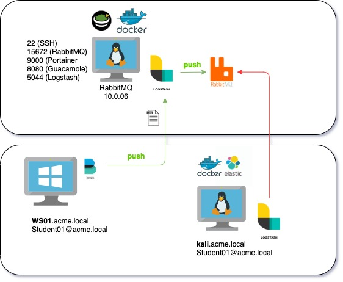

#   Chapter 1.7.2 - Packetbeat
>This chapter explains how to install the Packetbeat on your `Kali Linux Machine`, and ship logs to the RabbitMQ server.

***RabbitMQ*** is a message queue that is used in this class to collect all the students winlogbeat logs, through a logstash instance.

The pipeline looks like this:



From your Kali Linux Machine's Packetbeat Agent -> Logstash (on RabbitMQ server) -> RabbitMQ (on RabbitMQ server). Later on we will configure the student ELK servers to pull the logs from their queue.

- logstash listens on **TCP 5044**
- RabbitMQ listens on **TCP 5672**

```code
snippet
```
Connect with `GUACAMOLE SSH` to your Kali Linux, select the right student number that was assigned to you in the beginning of the class:

> **NOTE**: The username and password for the Guacamole server are ***"thadmin" / "PROVIDED_PASSWORD"***. For the RDP/SSH connection your username __and__ password are studentxx. So if you are ***"student04"***, both your username and password for the windows machine will be ***"student04"***.

**Guacamole Username: thadmin**  
**Guacamole Password : PROVIDED_PASSWORD**


441  cd mkdir  
  442  cd packetbeat/  
  443  ls  
  444  curl -L -O https://artifacts.elastic.co/downloads/beats/packetbeat/packetbeat-7.6.2-linux-x86_64.tar.gz  
  445  tar xzvf packetbeat-7.6.2-linux-x86_64.tar.gz  
  446  ls  
  447  cd packetbeat-7.6.2-linux-x86_64/  
  448  ls  
  449  nano packetbeat.yml   
  450  ifconfig  
  451  nano packetbeat.yml   
  452  packetbeat setup --dashboards  
  453  ls  
  454  ./packetbeat setup --dashboards  
  455  ./packetbeat   
  456  sudo service packetbeat start  
  457  cat README.md   
  459  ./packetbeat -c packetbeat.yml -e &  
  
https://www.elastic.co/guide/en/beats/packetbeat/current/packetbeat-geoip.html

