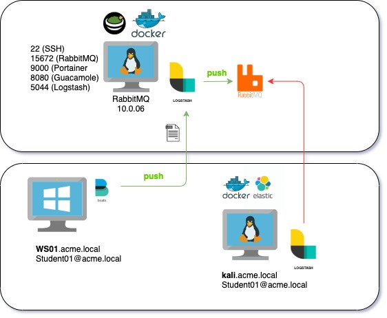

#   Chapter 1.7.3 - Auditbeat
>This chapter explains how to install the Auditbeat on your `Kali Linux Machine`, and ship logs to the RabbitMQ server.

***RabbitMQ*** is a message queue that is used in this class to collect all the students winlogbeat logs, through a logstash instance.

The pipeline looks like this:



From your Kali Linux Machine's Auditbeat Agent -> Logstash (on RabbitMQ server) -> RabbitMQ (on RabbitMQ server). Later on we will configure the student ELK servers to pull the logs from their queue.

- logstash listens on **TCP 5044**
- RabbitMQ listens on **TCP 5672**

```code
snippet
```
Connect with `GUACAMOLE SSH` to your Kali Linux, select the right student number that was assigned to you in the beginning of the class:

> **NOTE**: The username and password for the Guacamole server are ***"thadmin" / "PROVIDED_PASSWORD"***. For the RDP/SSH connection your username __and__ password are studentxx. So if you are ***"student04"***, both your username and password for the windows machine will be ***"student04"***.

**Guacamole Username: thadmin**  
**Guacamole Password : PROVIDED_PASSWORD**

