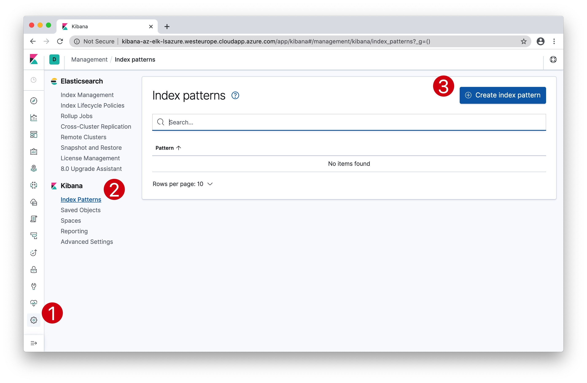
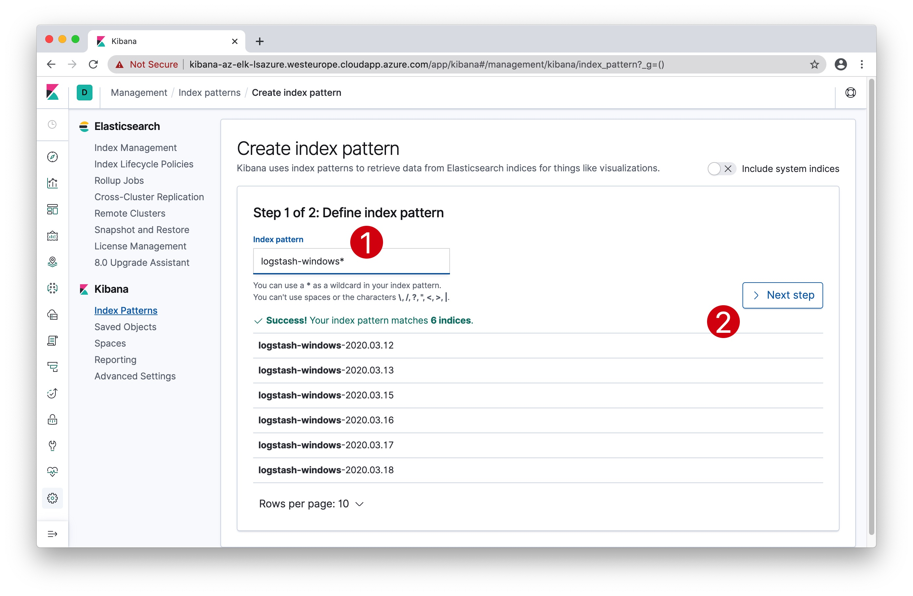
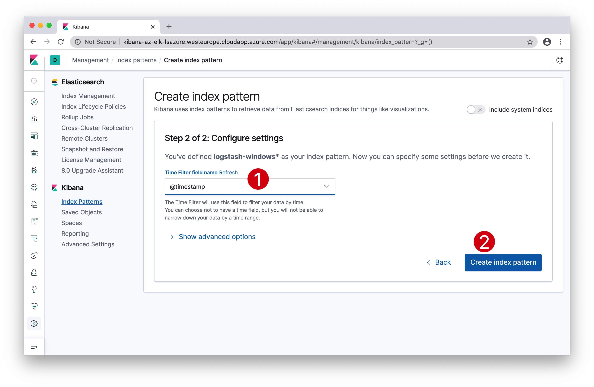

#   Chapter 1.7.1 - Winlogbeat
>This chapter explains how to install the Winlogbeat on your `Windows 10 Machine`, and ship logs to the RabbitMQ server.

***RabbitMQ*** is a message queue that is used in this class to collect all the students winlogbeat logs, through a logstash instance.

The pipeline looks like this:


From your Windows 10 Machine's Winlogbeat Agent -> Logstash (on RabbitMQ server) -> RabbitMQ (on RabbitMQ server). Later on we will configure the student ELK servers to pull the logs from their queue.

- logstash listens on **TCP 5044**
- RabbitMQ listens on **TCP 5672**

```code
(New-Object System.Net.WebClient).DownloadFile("https://artifacts.elastic.co/downloads/beats/winlogbeat/winlogbeat-7.4.2-windows-x86_64.zip", "C:\temp\winlogbeat-7.4.2-windows-x86_64.zip")
Expand-Archive C:\temp\winlogbeat-7.4.2-windows-x86_64.zip -DestinationPath "C:\program files\"
cd "C:\program files\winlogbeat-7.4.2-windows-x86_64"
dir
```
Connect with `GUACAMOLE RDP` to your Windows 10 machine, select the right student number that was assigned to you in the beginning of the class:

> **NOTE**: The username and password for the Guacamole server are ***"thadmin" / "PROVIDED_PASSWORD"***. For the RDP connection you username __and__ password are studentxx. So if you are ***"student04"***, both your username and password for the windows machine will be ***"student04"***.

**Guacamole Username: thadmin**  
**Guacamole Password : PROVIDED_PASSWORD**


Let's start by opening powershell open your Windows 10 machine by clicking on the windows logo in the bottom left corner, and just start typing "power":


```code
cd "c:\program files\

```

Open your web browser (preferably chrome) and surf to http://kibana-az-elk-`lsazure`.westeurope.cloudapp.azure.com/

You will be prompted to authenticate:

**Username:**
```code
test
```
**Password:**
```code
test
```
In Kibana:

1. Click on ***"Management"***, the little cogs in the left bottom corner,
2. then click on ***"Index Patterns"***,
3. and finally click on ***"Create index pattern"***



1. Enter the index name "logstash-windows*"
2. Click "Next Step"



1. Select the "time filter field" and select "@timestamp"
2. Click on "Create index pattern"



You have now created your Elastic index, and you will see a screen similar to this:


TROUBLESHOOTING WINLOGBEAT CONFIG FILES
====
.\winlogbeat.exe test output -e -d "*"
