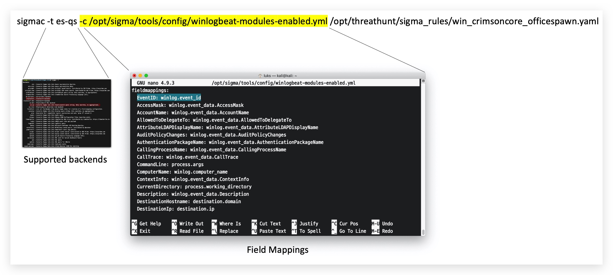
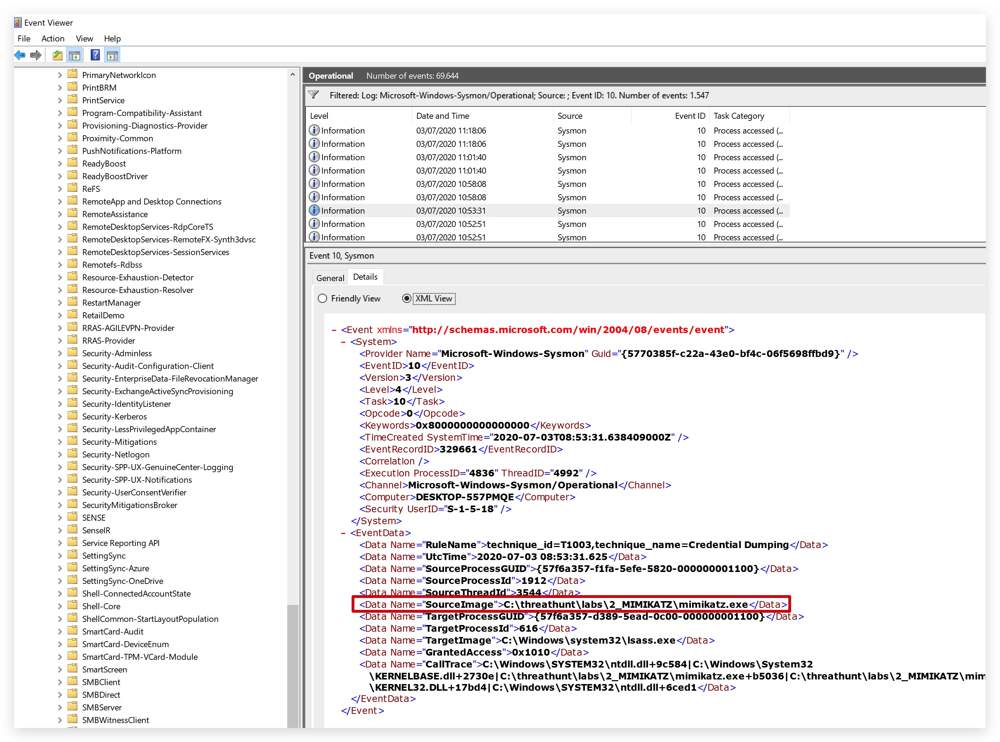
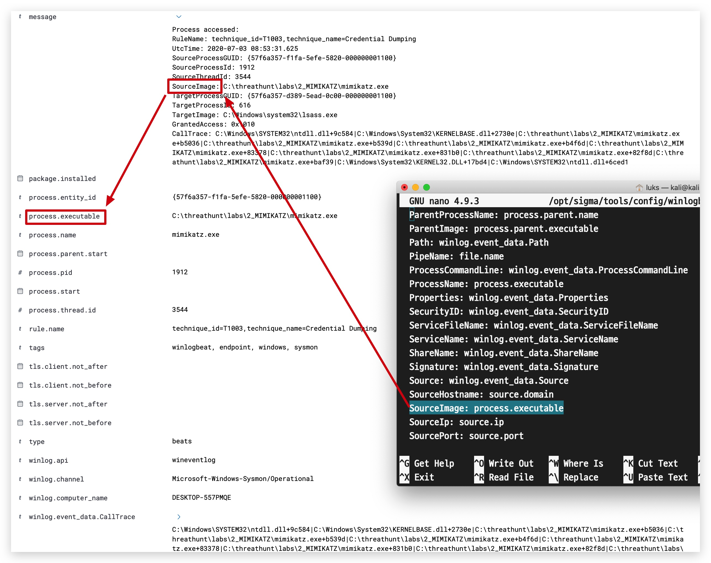
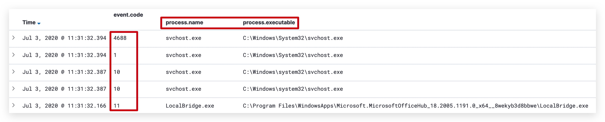
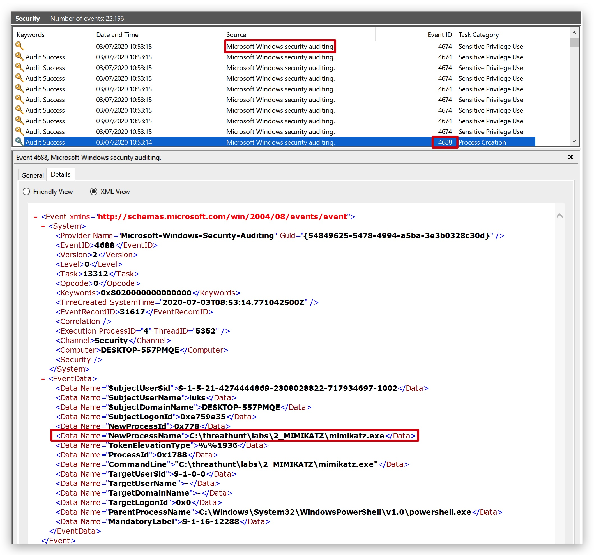
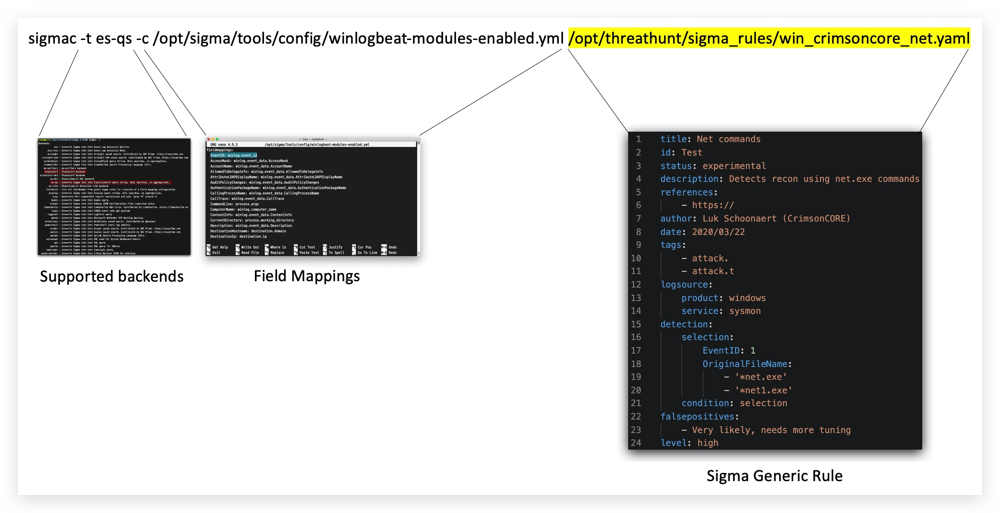
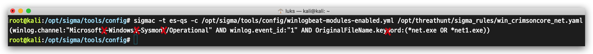

#   Chapter 1.7: Sigma
>This chapter explains how to install Sigma on your `Kali linux machine`

_"Sigma is a generic and open signature format that allows you to describe relevant log events in a straight forward manner. The rule format is very flexible, easy to write and applicable to any type of log file. The main purpose of this project is to provide a structured form in which researchers or analysts can describe their once developed detection methods and make them shareable with others."_


Installing Sigma
====

- SOURCE : ***[https://github.com/Neo23x0/sigma](https://github.com/Neo23x0/sigma)*** 

Login to your `kali linux machine` with SSH and login with your kali username and password 

**Kali Username : thadmin**  
**Kali Password : PROVIDED_PASSWORD**


```code
ssh thadmin@az-kali-lsazure.westeurope.cloudapp.azure.com
``` 

First we're going to install sigma-tools using ***pip3*** , we're hardcoding the version  (0.16.0)here for lab purposes.

```code
python3 -m pip install sigmatools==0.16.0
pip3 show sigmatools
``` 
> you can list all available versions by typing "sudo pip3 install sigmatools==?"

Then we'll clone the sigma rules from the ***crimsoncore/sigma.git*** repository this is a fork of the official repository and allows us to work on a more static code for this training.

```code
cd /opt
sudo git clone https://github.com/crimsoncore/sigma.git
``` 


Working with Sigma
====

Sigma supports multiple backends (the query for your specific SIEM) include all of the below, you can even generate powershell queries, WDATP (Microsoft Defender ATP) or queries for any popular SIEM:


So when we generate our first sigma rule, we first define the query language (our backend SIEM):


Then we select the Field Mappings - which normalizes raw field names to standardized ones across different log sources:

```code
cd /opt/sigma/tools/config
ls -l
```

We'll be using the ***winlogbeat-modules-enabled.yml*** Field Mappings configuration as this is how we configured our winlogbeat agent on windows.







If we would look in Kibana for ***process.executable : exists*** we will find different event ID's from several sources (Sysmon and Windows Security Auditing) - all have a different original raw field name, but by using these field mappins they get normalized:



As you can see ***EventID 4688*** (commandline logging from the windows security logs) has a raw field name called ***NewProcessName*** which gets also normalized. With the ***ECS*** (ELastic Common Schema) a lot of these field mappings happen automatically withon ELastic by using winlogbeat modules. If a certain field is missing, we'd need to add this field here in Sigma's mapping config file. 




> We could, for example, add the field winlog.event_data.OriginalFileName to the mapping file, scroll down a bit in the winlogbeat.yml file:


So let's write our first simple Sigma rule for detecting net commands:

```yaml
nano /opt/threathunt/sigma_rules/win_crimsoncore_net.yaml
```


copy/paste the following code, you can see here the OriginalFileName mapping is used, but it wasn't known in the default winlogbeat mapping as this is a rather new field in __sysmon__:

```yaml
title: Net commands
id:
status: experimental
description: Detects recon using net.exe commands
references:
    - https://
author: Luk Schoonaert (CrimsonCORE)
date: 2020/03/22
tags:
    - attack.
    - attack.t
logsource:
    product: windows
    service: sysmon
detection:
    selection:
        EventID: 1
        OriginalFileName:
            - '*net.exe'
            - '*net1.exe'
    condition: selection
falsepositives:
    - Very likely, needs more tuning
level: high
```

We'll now run sigma on this new rule template:



```code 
sigmac -t es-qs -c /opt/sigma/tools/config/winlogbeat-modules-enabled.yml /opt/threathunt/sigma_rules/win_crimsoncore_net.yaml
```

The resulting query is this:

```code
(winlog.channel:"Microsoft\-Windows\-Sysmon\/Operational" AND winlog.event_id:"1" AND OriginalFileName.keyword:(*net.exe OR *net1.exe))
```

***IMPORTANT!!! You will have to remove the escape "backslashes" and .keyword from the query the working Kibana query should look like this:*** 



> (winlog.channel : "Microsoft-Windows-Sysmon/Operational" AND winlog.event_id:"1" AND winlog.event_data.OriginalFileName:(*net.exe OR *net1.exe))

You can also write this query on the ***ProcessName*** instead of the ***OriginalFileName***

```yaml
title: Net commands
id:
status: experimental
description: Detects recon using net.exe commands
references:
    - https://
author: Luk Schoonaert (CrimsonCORE)
date: 2020/03/22
tags:
    - attack.
    - attack.t
logsource:
    product: windows
    service: sysmon
detection:
    selection:
        EventID: 1
        ProcessName:
            - '*net.exe'
            - '*net1.exe'
    condition: selection
falsepositives:
    - Very likely, needs more tuning
level: high
```

```code 
sigmac -t es-qs -c /opt/sigma/tools/config/winlogbeat-modules-enabled.yml /opt/threathunt/sigma_rules/win_crimsoncore_net.yaml
```

The resulting query is this:

```code
(winlog.channel:"Microsoft\-Windows\-Sysmon\/Operational" AND winlog.event_id:"1" AND process.executable.keyword:(*net.exe OR *net1.exe))
```
***Again you need to clean up the backslashes and .keyword argument.***