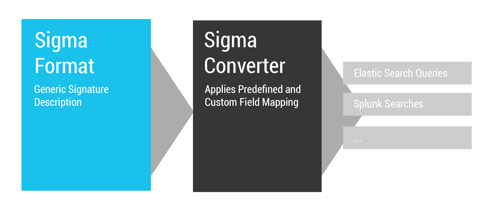
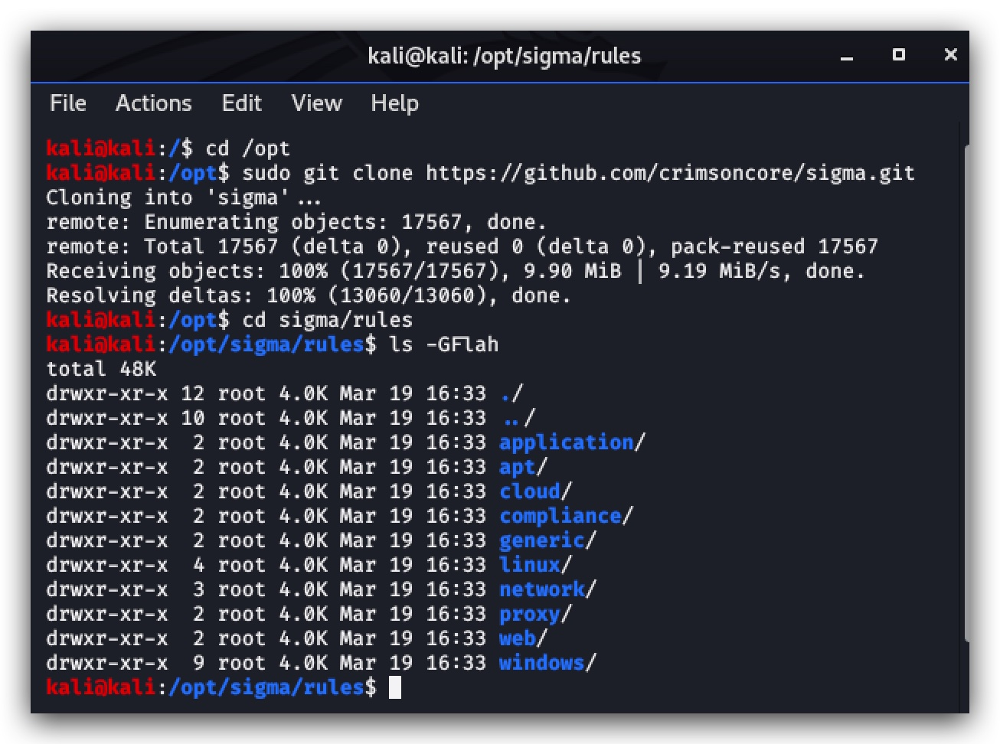
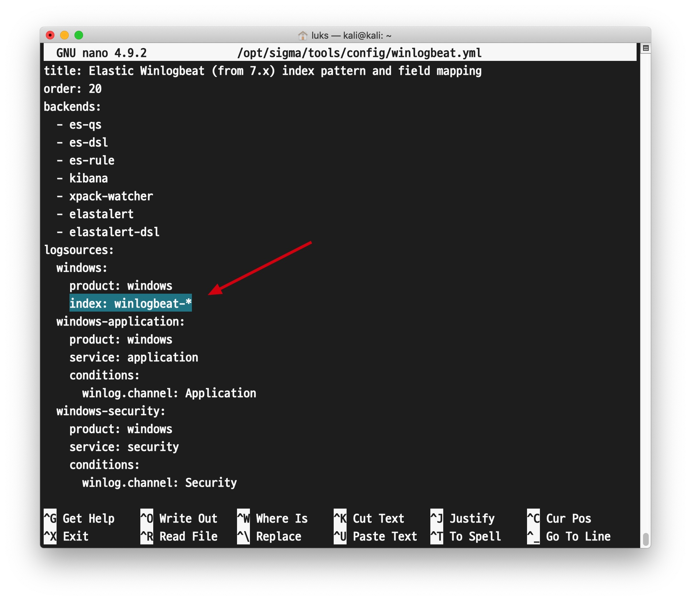
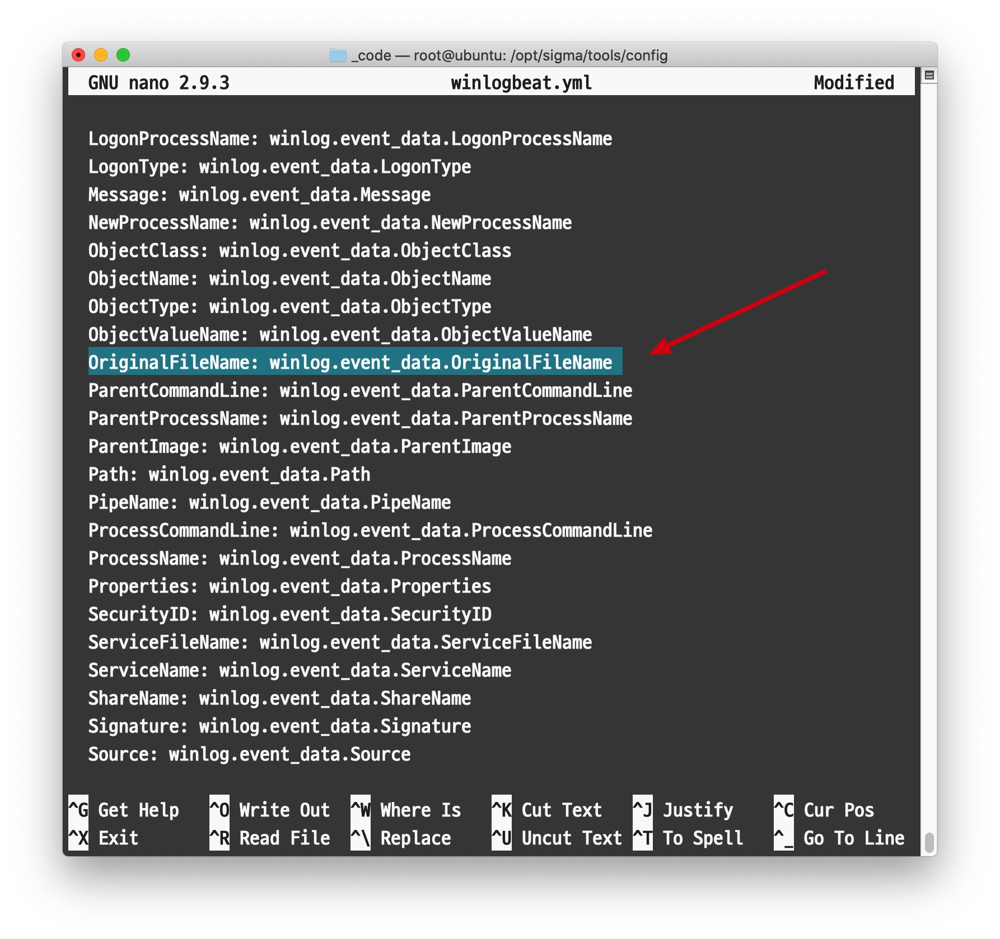
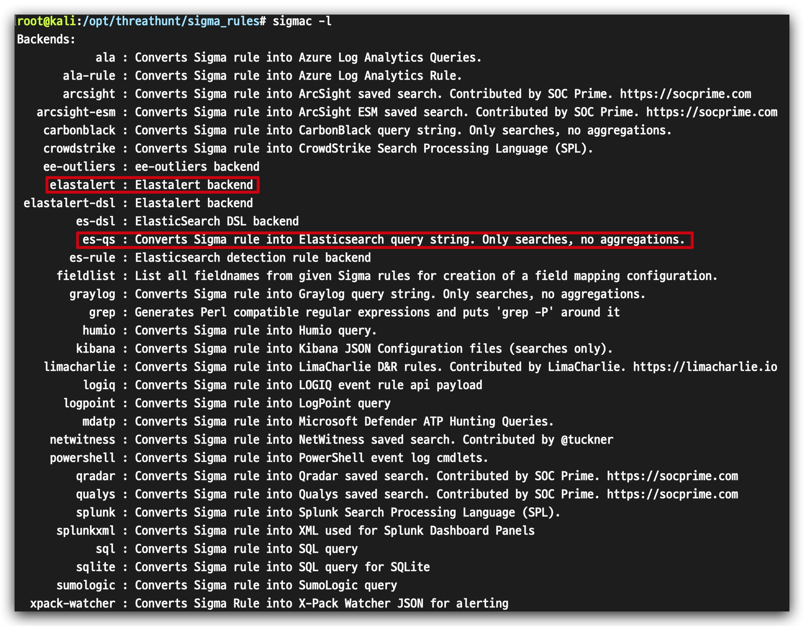
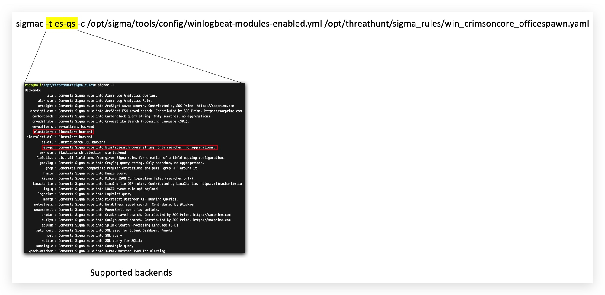

#   Chapter 1.7: Sigma
>This chapter explains how to install Sigma on your `Kali linux machine`

_"Sigma is a generic and open signature format that allows you to describe relevant log events in a straight forward manner. The rule format is very flexible, easy to write and applicable to any type of log file. The main purpose of this project is to provide a structured form in which researchers or analysts can describe their once developed detection methods and make them shareable with others."_




Installing Sigma
====

- SOURCE : ***[https://github.com/Neo23x0/sigma](https://github.com/Neo23x0/sigma)*** 

Login to your `kali linux machine` with SSH and login with your kali username and password 

**Kali Username : thadmin**  
**Kali Password : PROVIDED_PASSWORD**


```code
ssh thadmin@az-kali-lsazure.westeurope.cloudapp.azure.com
``` 

First we're going to install sigma-tools using ***pip3*** , we're hardcoding the version  (0.16.0)here for lab purposes.

```code
python3 -m pip install sigmatools==0.16.0
pip3 show sigmatools
``` 
> you can list all available versions by typing "sudo pip3 install sigmatools==?"

Then we'll clone the sigma rules from the ***crimsoncore/sigma.git*** repository this is a fork of the official repository and allows us to work on a more static code for this training.

```code
cd /opt
sudo git clone https://github.com/crimsoncore/sigma.git
``` 


Working with Sigma
====

Let's make a very simple Sigma rule that detects net.exe commands being executed. Before we start, let's edit the sigma mapping file:  

```code
nano /opt/sigma/tools/config/winlogbeat.yml
```



and change the index to the one we have configured in our ELK stack, the default value here is "winlogbeat-*" which we're going to change to "logstash-*" :

>We're also going to add the field winlog.event_data.OriginalFileName to the mapping file, scroll down a bit in the winlogbeat.yml file:




Very simple sigma rule for detecting net commands:

```yaml
nano /opt/threathunt/sigma_rules/win_crimsoncore_net.yaml
```

copy/paste the following code, you can see here the OriginalFileName mapping is used, but it wasn't known in the default winlogbeat mapping as this is a rather new field in symon:

```yaml
title: Net commands
id:
status: experimental
description: Detects recon using net.exe commands
references:
    - https://
author: Luk Schoonaert (CrimsonCORE)
date: 2020/03/22
tags:
    - attack.
    - attack.t
logsource:
    product: windows
    service: sysmon
detection:
    selection:
        EventID: 1
        OriginalFileName:
            - '*net.exe'
            - '*net1.exe'
    condition: selection
falsepositives:
    - Very likely, needs more tuning
level: high
```

```code 
sigmac -t es-qs -c /opt/sigma/tools/config/winlogbeat-modules-enabled.yml /opt/threathunt/sigma_rules/win_crimsoncore_net.yaml
```

> !!! You will have to remove the escape "\" and .keyword from the query 

resulting Kibana query:

> (winlog.channel : "Microsoft-Windows-Sysmon/Operational" AND winlog.event_id:"1" AND process.executable:(*net.exe OR *net1.exe))

So what is all this about?

Sigma backends (the query for your specific SIEM) include all of the below, you can even generate powershell queries, WDATP (Microsoft Defender ATP) and any popular SIEM:



So when we ran our sigma rule we first defined the query language (our backend SIEM):

