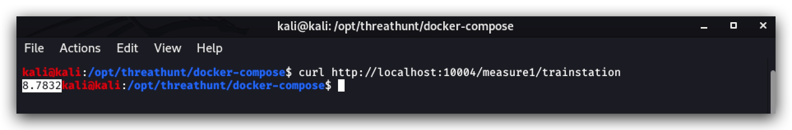
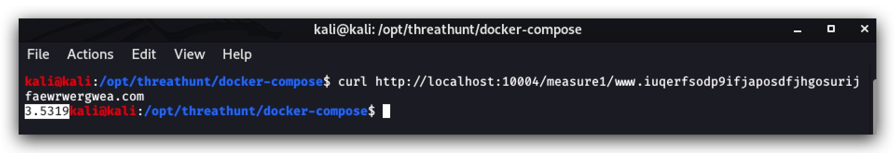

#   Chapter 1.8.1 - API's : Domain Stats / FreqServer

>This chapter explains how to enrich certain logs by adding Logstash filters on your `Kali Linux Machine`, we'll be using tagging and extra fields for frequency scores (how random is a certain domain/service/file name?), Adding geo-location fields, add tags to define if a device is internal/external and pull in whois information on dns queries.


1.0 INSTALLING FreqServer
===
_"Mark Baggett’s (@MarkBaggett - GSE #15, SANS SEC573 Author) Awesome-Sauce tool for detecting randomness using NLP techniques rather than pure entropy calculations. Uses character pair frequency analysis to determine the likelihood of tested strings of characters occurring based upon the chosen frequency tables (some prebuilt English text freq tables provided). Extremely useful for detecting high entropy where it shouldn’t be. Especially powerful for discovering DNS based DGAs commonly used for malware C2 and exfiltration. Think bigger than DGAs though. Random file names, script names, process names, service names, workstation names, TLS certificate subjects and issuer subjects, etc."_

First we're going to install __FreqServer__ on our Kali Lunix machine

- GITHUB : ***[Original Github Code](https://github.com/MarkBaggett/freq)*** (we're using the latest docker build from Security Onion)
- DOCUMENTATION : ***[Security Onion FreqServer](https://github.com/Security-Onion-Solutions/security-onion/wiki/FreqServer)***
- YOUTUBE : ***[Getting the Most out of Freq and Domain_Stats by Mark Baggett](https://www.youtube.com/watch?v=dfrh1FaFUic&feature=youtu.be)***

```code
cd /opt/threathunt/docker-compose
sudo docker-compose -f docker-compose.freqserver.yml up -d
```

Let's have a closer look at the docker-compose file:

```yaml
version: '3'
services:    
  freqserver:
    image: securityonionsolutions/so-freqserver
    container_name: freqserver
    restart: unless-stopped
    ports:
      - 10004:10004
    networks:
      - elastic
networks:
  elastic:
    driver: bridge
```

We're now running freqserver (a python script in a docker container, listening on port 10004).

Let's feed is a valid english word:

``` code
curl http://localhost:10004/measure1/trainstation
```



We get a score of 8.7832 - the idea here is that the higher the score, the more likely this is an existing (and thus not randomly generated term).

Now let's try some random DGA (the one from [Wannacry](https://www.fireeye.com/blog/threat-research/2017/05/wannacry-malware-profile.html) in this case)

```code
curl http://localhost:10004/measure1/www.iuqerfsodp9ifjaposdfjhgosurijfaewrwergwea.com
```

We get a score of 3.5319 - a much lower score, as this is clearly not a human generated FQDN. So the lower the score, the more "risky" this is. Now of course there are valid tools that generated random hostnames/ fqdns / servic names and so on - but we'll enriching logs here in multiple ways to create more context.

- Have we seen this domain/service name/file name before in our evironment?
- How often, how rare is this?  
- What's the frequency score?  
- what was the parent process that made the call to the domain or created the service?  
- If it is a domain name, what is the geo-location?
- When was the domain registered? Is it in the Cisco Umbrella Top1 most visited websites?



2.0 INSTALLING Domain_Stats
===
 
internal/external tagging  
geolocation  
