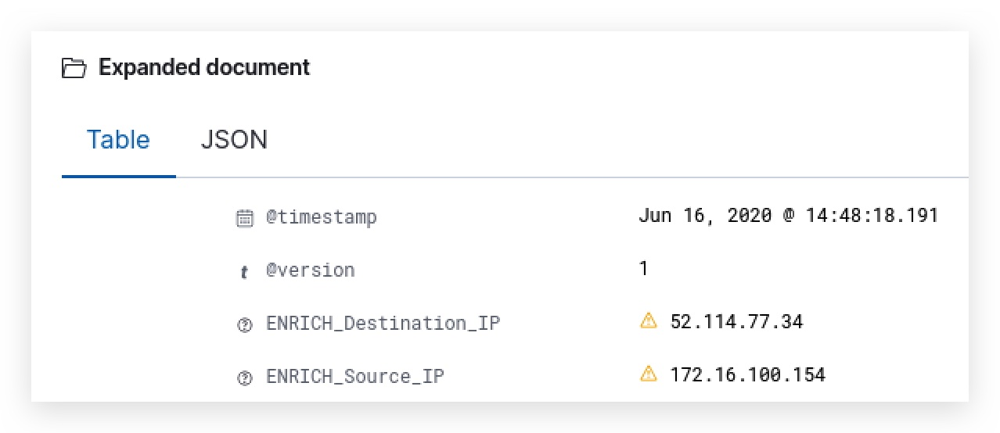
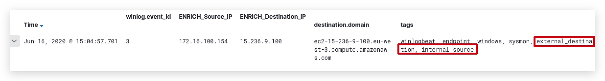
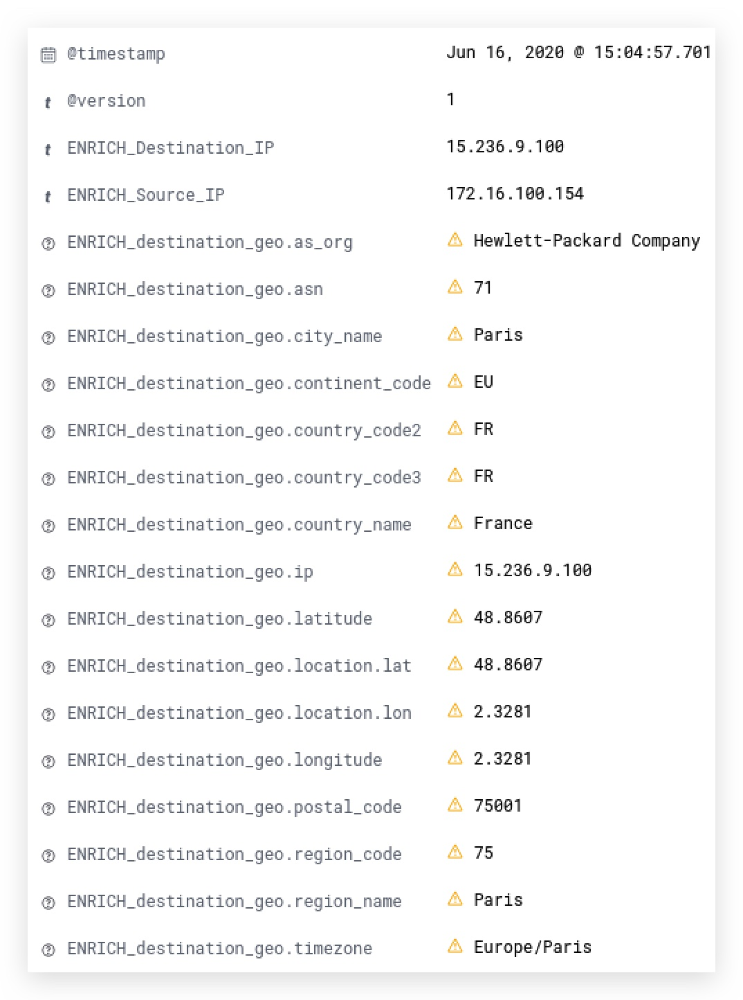

#   Chapter 1.8.2 - Logstash FIlters

>This chapter explains how to query the 2 previously API's and add custom fields with the results to the logs, before they get indexed>

1.0 LOGSTASH configuration for FreqServer on DNS records
===

```code
cd /opt/threathunt/logstash/logstash_enrich
sudo nano 410_enrich_filter_windows_sysmon_dns_freq.conf
```

```yaml
filter {                                                                                                                        
    if [winlog][event_id] == 22 {                                                                                                
        mutate {                                                                                                                 
            add_tag => [ "DNS_log" ]                                                                                              
            add_field => { "[QueryName]" => "%{[dns][question][name]}" }
        }
        tld {
          source => "QueryName"
        }
        # Rename fields from the tld filter plugin
        mutate {
          rename => { "[tld][domain]" => "ENRICH_DNS_highest_registered_domain" }
          rename => { "[tld][subdomain]" => "ENRICH_DNS_tld_sub" }
          rename => { "[tld][trd]" => "ENRICH_DNS_subdomain" }
          rename => { "[tld][tld]" => "ENRICH_DNS_top_level_domain" }
          rename => { "[tld][sld]" => "ENRICH_DNS_parent_domain" }
        }
        # Check if ENRICH_DNS_tld_sub has any value, to avoid REST API errors -> then it has a value then query for frequency score
        if [ENRICH_DNS_tld_sub] {
          rest {
            request => {
              url => "http://freqserver:10004/measure1/%{ENRICH_DNS_tld_sub}"
            }
            sprintf => true
            json => false
            target => "ENRICH_DNS_FullQuery_FREQ"
          }
        }
        # Check if ENRICH_DNS_subdomain has any value, to avoid REST API errors -> then it has a value then query for frequency score
        if [ENRICH_DNS_subdomain] {
          rest {
            request => {
              url => "http://freqserver:10004/measure1/%{ENRICH_DNS_subdomain}"
            }
            sprintf => true
            json => false
            target => "ENRICH_DNS_SubQuery_FREQ"
          }
        }
        # Check if ENRICH_DNS_parent_domain has any value, to avoid REST API errors -> then it has a value then query for frequency score
        if [ENRICH_DNS_parent_domain] {
          rest {
            request => {
              url => "http://freqserver:10004/measure1/%{ENRICH_DNS_parent_domain}"
            }
            sprintf => true
            json => false
            target => "ENRICH_DNS_ParentQuery_FREQ"
          }
          mutate {
          convert => [ "ENRICH_DNS_ParentQuery_FREQ", "float" ]
          }
        }
        # If parent domain has a low frequency score, tag it with "DGA" -> scores below 4.0 are potential DGA's
        if [ENRICH_DNS_ParentQuery_FREQ] and [ENRICH_DNS_ParentQuery_FREQ] != 0 and [ENRICH_DNS_ParentQuery_FREQ] < 4.0 {
          mutate {
            add_tag => [ "DGA" ]
          }
        }
        rest {
          request => {
            url => "http://domainstats:20000/alexa/%{QueryName}"
          }
          sprintf => true
          json => false
          target => "ENRICH_domain_score"
        }
        mutate {
          convert => [ "ENRICH_domain_score", "float" ]
        }
        # If domain score value exists, tag it with "top1-m"
        if [ENRICH_domain_score] >= 1.0 {
          mutate {
            add_tag => [ "top-1m" ]
          }
        }
        rest {
          request => {
            url => "http://domainstats:20000/domain/creation_date/%{QueryName}"
          }
          sprintf => true
          json => false
          target => "ENRICH_domain_creationdate"
        }
        mutate {
          remove_field => [ "QueryName" ]
        }
    }
}
```

```code
cd /opt/threathunt/logstash/logstash_enrich
ls -l
cp 410_enrich_filter_windows_sysmon_dns_freq.conf /opt/threathunt/logstash/pipeline
```

```code
sudo docker restart logstash_rest
sudo docker container logs logstash_rest --follow
```
You should this as the last messages in your logstash container logs, this means Logstash has rebooted and succesfully applied the new configuration:

```
[2020-06-16T10:37:22,694][INFO ][logstash.inputs.beats    ][main] Beats inputs: Starting input listener {:address=>"0.0.0.0:5044"}
[2020-06-16T10:37:22,719][INFO ][logstash.javapipeline    ][main] Pipeline started {"pipeline.id"=>"main"}
[2020-06-16T10:37:22,849][INFO ][logstash.agent           ] Pipelines running {:count=>1, :running_pipelines=>[:main], :non_running_pipelines=>[]}
[2020-06-16T10:37:22,874][INFO ][org.logstash.beats.Server][main] Starting server on port: 5044
[2020-06-16T10:37:23,092][INFO ][logstash.agent           ] Successfully started Logstash API endpoint {:port=>9600}
```

If you go to Kibana now and filter for __winlog.event_id : 22__ (Sysmon DNS logs) you will see the new fields appear with a yellow triangle that has am exclamation mark. This means your filter is working and the new fields are added to your DNS logs. However, these new fields still need to be indexed in order to be able to perform searches on them.

 

This is easy to fix in Kibana:

1. Click on ***"Management"***, the little cogs in the left bottom corner,
2. then click on ***"Index Patterns"***,
3. and finally select your ***"winlogbeat-"*** index
4. click on ***refresh*** (the icon with the 2 arrows right top corner next to the red trash icon)


If you now go back to your main Kibana Discover tab and you open a DNS event (winlog.event_id : 22), you'll see the orange triangles have disappeared and you can now do searches on the new fields:


Let's hunt with our enriched data!

on your windows machine open a command prompt and __ping www.iuqerfsodp9ifjaposdfjhgosurijfaewrwergwea.com__ (remember, the wannacry DGA). The go to your Kibana discover tab and run this query:

```code
winlog.event_id : 22 AND ENRICH_DNS_ParentQuery_FREQ <= 4.0
```
or we can hunt on tags:

```code
winlog.event_id : 22 AND tags : DGA
```

> ***NOTE:***You can also save tgis queries and use them later on to build visualisations and dashboards!!!


3.0 ADD Network and GEO Location metadata
===

copy __320_enrich_sourcedest_ip.conf__ to your pipeline, this adds source and destination IP fields, if they exist. We will use these later to define if they are internal/external, and if external - add GEO IP location info.

```yaml
filter {
  if [source][ip] and [source][ip] != "-" {
    mutate {
      add_field => { "[ENRICH_Source_IP]" => "%{[source][ip]}"}
    }
  }
  if [destination][ip] and [destination][ip] != "-" {
    mutate {
      add_field => { "[ENRICH_Destination_IP]" => "%{[destination][ip]}"}
    }
  }
}
```

Don't forget to restart Logstash:

```code
sudo docker restart logstash_rest
sudo docker container logs logstash_rest --follow
```

Check your Kibana Discover page and __refresh your index__ so the new fields are searchable.



next copy __380_enrich_network.conf__ to your pipeline, this will add tags (broadcast, internal, external etc...)

```yaml
filter {
  if [ENRICH_Destination_IP] =~ "2(?:2[4-9]|3\d)(?:\.(?:25[0-5]|2[0-4]\d|1\d\d|[1-9]\d?|0)){3}" {
    mutate {
      add_tag => [ "multicast" ]
    }
  }
  if [ENRICH_Destination_IP] == "255.255.255.255" {
    mutate {
      add_tag => [ "broadcast" ]
    }
  }
  if [ENRICH_Destination_IP] and "multicast" not in [tags] and "broadcast" not in [tags] {
    if [ENRICH_Destination_IP] =~ "^10\." or [ENRICH_Destination_IP] =~ "192\.168\." or [ENRICH_Destination_IP] =~ "172\.(1[6-9]|2[0-9]|3[0-1])\." {
      mutate {
        add_tag => [ "internal_destination" ]
      }
    } else {
      mutate {
        add_tag => [ "external_destination" ]
      }
    }
    if "internal_destination" not in [tags] {
      if [ENRICH_Destination_IP] == "198.41.0.4" or [ENRICH_Destination_IP] == "192.228.79.201" or [ENRICH_Destination_IP] == "192.33.4.12" or [ENRICH_Destination_IP] == "199.7.91.13" or [ENRICH_Destination_IP] == "192.203.230.10" or [ENRICH_Destination_IP] == "192.5.5.241" or [ENRICH_Destination_IP] == "192.112.36.4" or [ENRICH_Destination_IP] == "198.97.190.53" or [ENRICH_Destination_IP] == "192.36.148.17" or [ENRICH_Destination_IP] == "192.58.128.30" or [ENRICH_Destination_IP] == "193.0.14.129" or [ENRICH_Destination_IP] == "199.7.83.42" or [ENRICH_Destination_IP] == "202.12.27.33" {
        mutate {
          add_tag => [ "root_dns_server" ]
        }
      }
    }
  }
  if [ENRICH_Source_IP] {
    if [ENRICH_Source_IP] =~ "^10\." or [ENRICH_Source_IP] =~ "192\.168\." or [ENRICH_Source_IP] =~ "172\.(1[6-9]|2[0-9]|3[0-1])\." {
      mutate {
        add_tag => [ "internal_source" ]
      }
    } else {
      mutate {
        add_tag => [ "external_source" ]
      }
    }
    if "internal_source" not in [tags] {
      if [ENRICH_Source_IP] == "198.41.0.4" or [ENRICH_Source_IP] == "192.228.79.201" or [ENRICH_Source_IP] == "192.33.4.12" or [ENRICH_Source_IP] == "199.7.91.13" or [ENRICH_Source_IP] == "192.203.230.10" or [ENRICH_Source_IP] == "192.5.5.241" or [ENRICH_Source_IP] == "192.112.36.4" or [ENRICH_Source_IP] == "198.97.190.53" or [ENRICH_Source_IP] == "192.36.148.17" or [ENRICH_Source_IP] == "192.58.128.30" or [ENRICH_Source_IP] == "193.0.14.129" or [ENRICH_Source_IP] == "199.7.83.42" or [ENRICH_Source_IP] == "202.12.27.33" {
        mutate {
          add_tag => [ "root_dns_server" ]
        }
      }
    }
    if "internal_source" in [tags] and "internal_destination" in [tags] {
      mutate { add_tag => [ "internal_only" ] }
    }
  }
}
```

Don't forget to restart Logstash:

```code
sudo docker restart logstash_rest
sudo docker container logs logstash_rest --follow
```

Check your Kibana Discover page again and __refresh your index__ so the new fields are searchable. You'll see that all network connections (Sysmon event ID 3) get tagged with internal/external tags. You can use these to search combined with other fields.




Finally for the external destinations, let's do a GEO Location lookup:

```yaml
filter {
  if [ENRICH_Destination_IP] {
    if [ENRICH_Destination_IP] == "-" {
      mutate {
        replace => { "ENRICH_Destination_IP" => "0.0.0.0" }
      }
    }
    if "external_destination" in [tags] {
      geoip {
        source => "[ENRICH_Destination_IP]"
        target => "ENRICH_destination_geo"
      }
      geoip {
        default_database_type => "ASN"
        source => "[ENRICH_Destination_IP]"
        target => "ENRICH_destination_geo"
      }
    }
  }
}
```

Don't forget to restart Logstash:

```code
sudo docker restart logstash_rest
sudo docker container logs logstash_rest --follow
```

Check your Kibana Discover page again and __refresh your index__ so the new fields are searchable. You'll see that GEO location has been added to all public (externally tagged) destinations:

