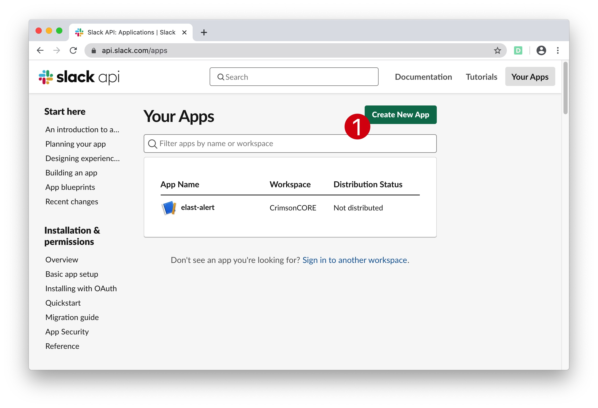
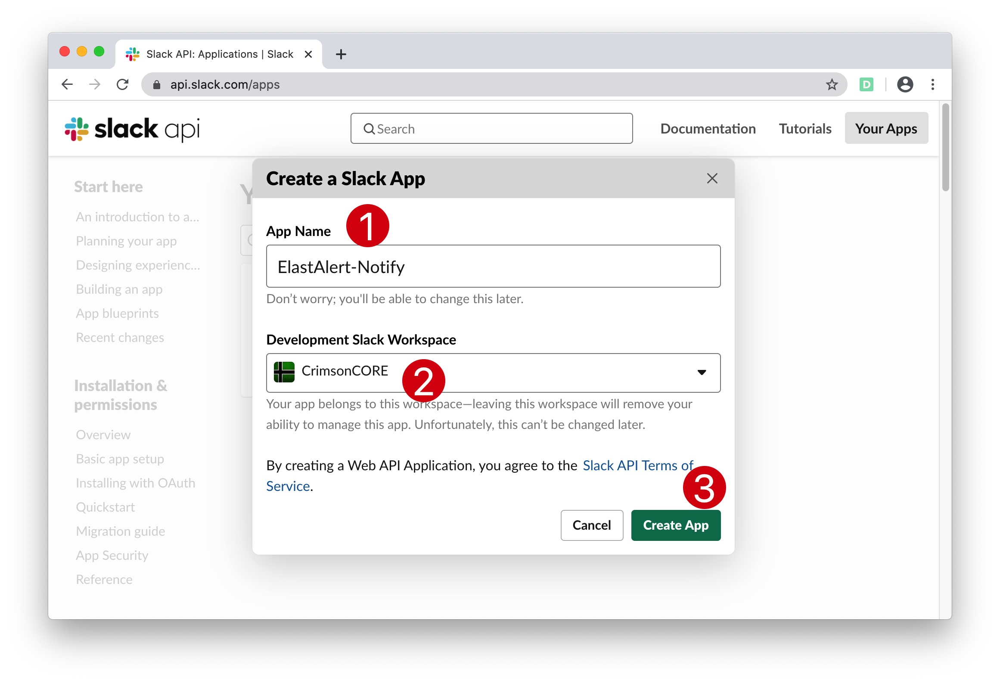
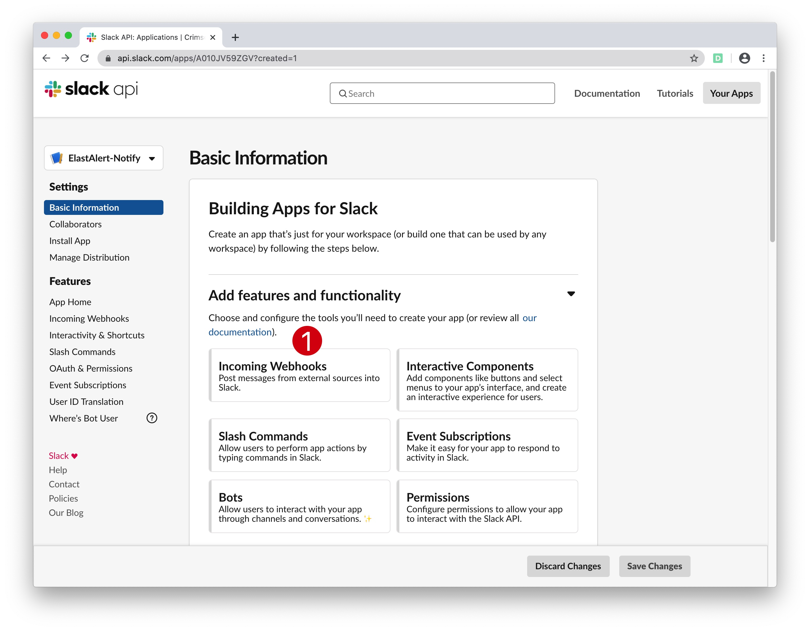
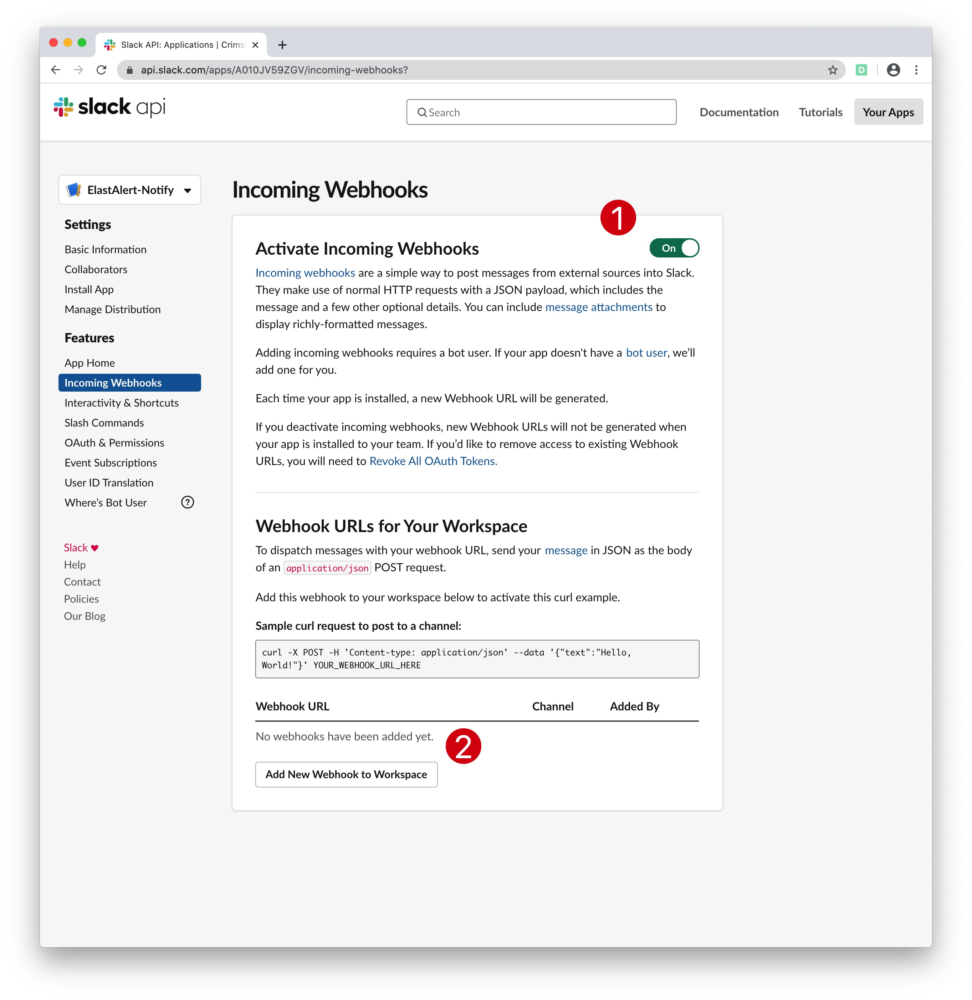
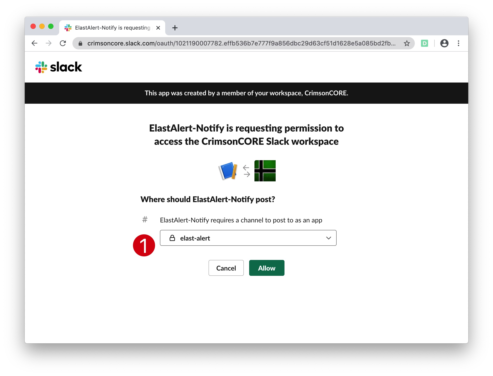
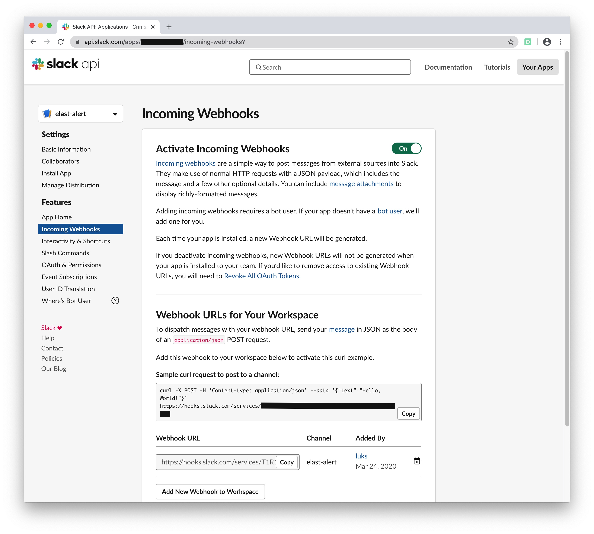

#   Chapter 1.9.2 - Slack Webhooks for ElastAlert

go to https://api.slack.com/apps and click on create new app:  

Select the app-name and your workspace

Click on "Incoming Webhooks"

Slide the "Activate Incoming Webhooks" button to the right

