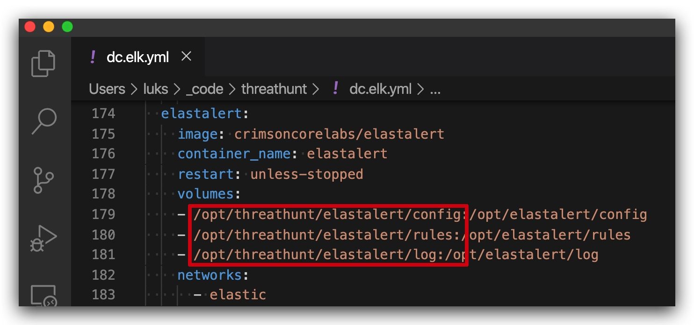

#   Chapter 1.9 - Alerting

Manual Install of elastalert on `Kali Linux machine`
====

>In the labs we'll be skipping these steps, and instead install ElastALert as a docker container on your `Kali Linux machine`, where also you ELK stack is running in docker.

```code
apt install python3-pip  
python3 -m pip install pip --upgrade && python3 -m pip install wheel  
sudo -H pip3 install --ignore-installed PyYAML  
python3 -m pip install elastalert==0.2.1  
```

We're going to create the directories for the elastalert rules and configuration file:

```code
mkdir /opt/elastalert  
mkdir /opt/elastalert/rules  
mkdir /opt/elastalert/log  
mkdir /opt/elastalert/config    
nano /opt/elastalert/config/config.yaml    
```

And then edit the config.yaml:

```yml
rules_folder: rules
run_every:
    seconds: 30
buffer_time:
    seconds: 45
es_host: es01
es_port: 9200
alert_time_limit:
    days: 1
writeback_index: elastalert_status
alert_text: "Index: {0} \nEvent_Timestamp: {1} \nBeat_Name: {2} \nUser_Name: {3} \nHost_Name: {4} \nLog_Name: {5} \nOriginal_Message: \n\n{6}"
alert_text_type: alert_text_only
alert_text_args: ["_index","@timestamp","beat.name","user_name","host_name","log_name","z_original_message"]
```

then let's create the necessary indexes in our elastic stack

```python 
python3 -m elastalert.create_index --index elastalert_status --config /opt/elastalert/config/config.yaml
```


Create an ElastAlert rule
====

The following instruction will load the field-mappings (`winlogbeat.yml`) then use the sigma rule (`alert_win_crimsoncore_net.yaml`) to generate an ElastAlert rule (`alert_win_crimsoncore_net.yaml`) in the /opt/threathunt/elastalert/rules/ directory which is mapped to the docker instance of ElastAlert. 

See image below which show parts of the docker-compose file that runs ElastALert in a cointainer:



```code
sigmac --target elastalert --config /opt/sigma/tools/config/winlogbeat.yml --output /opt/threathunt/elastalert/rules/alert_win_crimsoncore_net.yaml /opt/threathunt/sigma_rules/win_crimsoncore_net.yaml
```

```code
python3 -m elastalert.elastalert --config /opt/elastalert/config.yaml  --verbose --start $(date +"%Y-%m-%d")
```

go to your kibana and make sure you create elast-alert indexes by going to Management -> Index Patterns -> "Create index pattern" and enter the index-name "elastalert-*"

Elast-Alert docs
https://elastalert.readthedocs.io/en/latest/index.html

This is the result ElastAlert rule:

```yml
#alert:
#- debug
description: Detects recon using net.exe commands
filter:
- query:
    query_string:
      query: (winlog.channel:"Microsoft\-Windows\-Sysmon\/Operational" AND winlog.event_id:"1"
        AND winlog.event_data.OriginalFileName:("*net1.exe" "*net.exe"))
index: logstash-*
name: Net-commands_0
priority: 2
realert:
  minutes: 0
type: any

alert_text: "{2} Endpoint: {0} CommandLine: {1} Link: {3}"
alert_text_type: alert_text_only
alert_text_args:
- host.name
- winlog.event_data.CommandLine
- "@timestamp"
- kibana_link

#<a href='{3}'>Kibana link</a>

alert:
- "slack"
slack:
slack_webhook_url: "https://hooks.slack.com/services/pasteyourhookhere"
```
