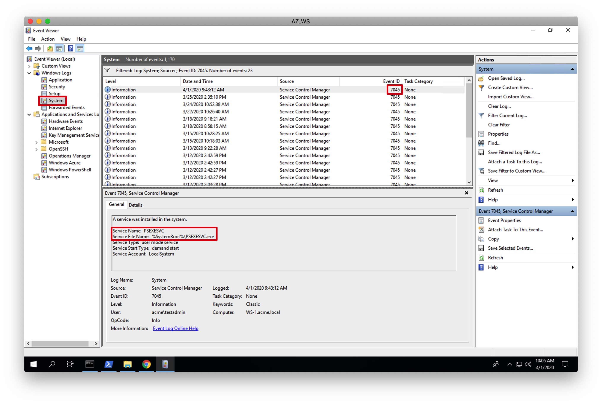
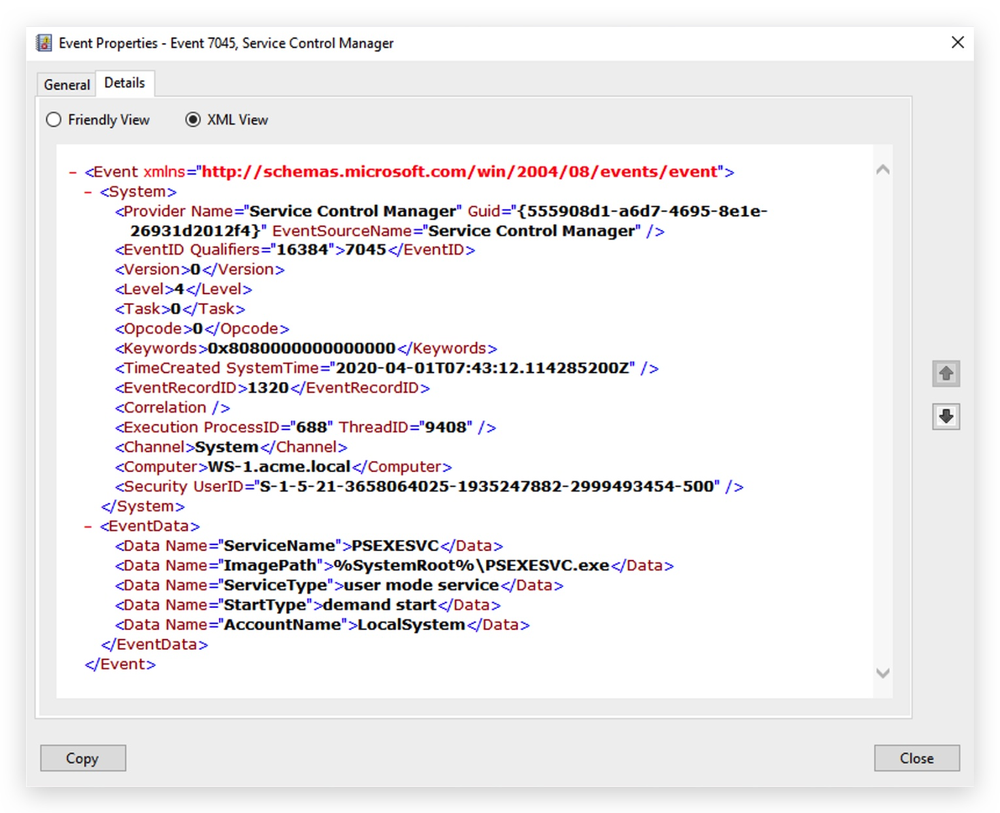
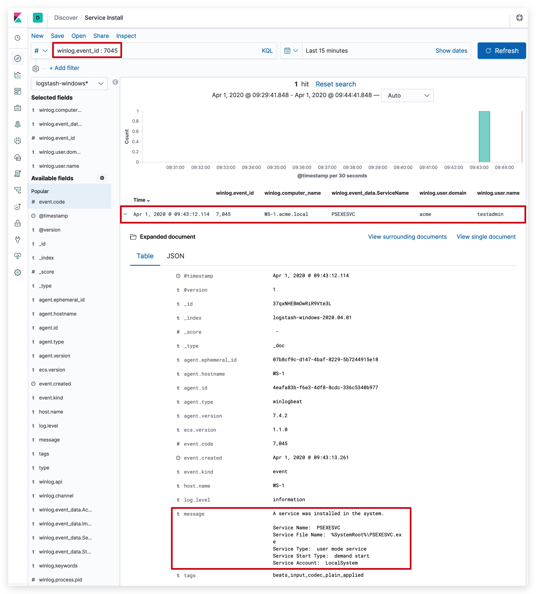

# Chapter 2.2.1 - Service Installation

The simplest way to check if you are logging service installations in this lab is by downloading PSEXEC to your C:\ and executing the following on you Windows workstation:

```code
mkdir C:\temp
(New-Object System.Net.WebClient).DownloadFile("https://download.sysinternals.com/files/PSTools.zip", "C:\temp\PSTools.zip")
Expand-Archive C:\temp\PSTools.zip -DestinationPath "C:\temp\PSTools"
copy "C:\temp\PSTools\Psexec64.exe" "C:\" -force
cd "C:\"
dir
```

```
cd \
psexec64 -s -I cmd.exe
```
In your eventviewer you will find the following under __"Windows Logs" -> "System"__



You can also view the raw XML of this event - we will use this later to check our fieldnames in our detection rules with sigma, and for enrichment with Logstash (freqserver)



In your kibana the event will look like this:



ENRICHING
====

on your Kali Linux Machine add the following filter to your logstash pipeline

```code
cd /opt/threathunt/logstash/pipeline
nano 301_enrich_filter_windows_security_service_freq.conf
```

```YAML
filter {
    if [winlog][event_id] == 7045 or [winlog][event_id] == 4697 {
        mutate {
            add_tag => [ "ServiceFlag7045" ]
            add_field => { "[ServiceName]" => "%{[winlog][event_data][ServiceName]}" }
        }
        rest {
          request => {
            url => "http://freqserver:10004/measure1/%{ServiceName}"
          }
          sprintf => true
          json => false
          target => "frequency_score"
        }
        mutate {
          convert => [ "frequency_score", "float" ]
        }
    }
}
```

> Don't forget to restart your logstash docker container, you can do this through portainer or by typing the following command:
> ```code
> docker container restart logstash_rest
> docker container logs logstash_rest --follow
> ```

now perform the psexec again - check your kibana interface and don't forget to refresh the index fields (some new fields have been added)

PERSISTENCE USER CREATION
====
```code
net user systembackup Default3104 /add /active:"yes" /expires:"never" /passwordchg:"NO"
net localgroup "Remote Desktop Users" systembackup /add
```

eventid 4720, 4732