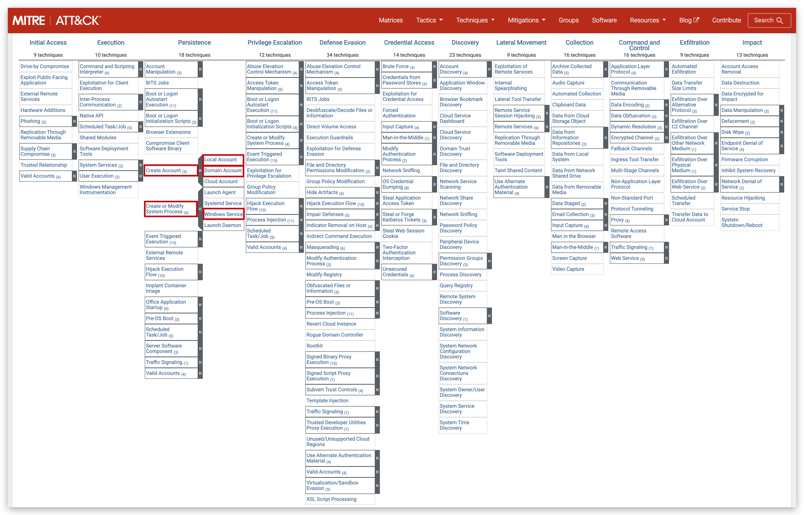

# CHAPTER 2.1 : PERSISTENCE

**Mitre: T1136**
--
- source: ***[https://attack.mitre.org/beta/techniques/T1136/](https://attack.mitre.org/beta/techniques/T1136/)***

>Adversaries may __create an account__ to maintain access to victim systems. With a sufficient level of access, creating such accounts may be used to establish secondary credentialed access that do not require persistent remote access tools to be deployed on the system. Accounts may be created on the local system or within a domain or cloud tenant. In cloud environments, adversaries may create accounts that only have access to specific services, which can reduce the chance of detection.

**Mitre: T1543**
--
- source: ***[https://attack.mitre.org/beta/techniques/T1543/](https://attack.mitre.org/beta/techniques/T1543/)***

>Adversaries may install new __services__, daemons, or agents that can be configured to execute at startup or a repeatable interval in order to establish persistence. Similarly, adversaries may modify existing services, daemons, or agents to achieve the same effect.

The following lab will show how adversaries persist within environments. We will be focusing on two very common techniques

- account creation (**T1136.002** and **T1136.002**)
- service installation (**T1543.003**)

