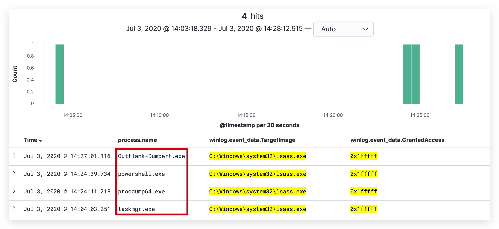

# Chapter 2.3.2 - CREDENTIAL DUMPING - Building the detection 
----
> Mitre: [T1003](https://attack.mitre.org/techniques/T1003/) - Credential Dumping


1.0 DETECTING MIMIKATZ (LSASS INJECTION)
----
> **LOG SOURCES**:
> - EID 10 (SYSMON) - Process Access

```yaml
title: Mimikatz Detection LSASS Access
status: experimental
description: Detects process access to LSASS which is typical for Mimikatz (0x1000 PROCESS_QUERY_ LIMITED_INFORMATION, 0x0400 PROCESS_QUERY_ INFORMATION "only $
    versions", 0x0010 PROCESS_VM_READ)
references:
    - https://cyberwardog.blogspot.com/2017/03/chronicles-of-threat-hunter-hunting-for_22.html
tags:
    - attack.t1003
    - attack.s0002
    - attack.credential_access
logsource:
    product: windows
    service: sysmon
detection:
    selection:
        EventID: 10
        TargetImage: 'C:\Windows\system32\lsass.exe'
        GrantedAccess:
            - '0x1410'
            - '0x1010'
    condition: selection
falsepositives:
    - unknown
level: high
```

Sigma rule generation:

```code
sigmac -I -t es-qs -c /opt/sigma/tools/config/winlogbeat-modules-enabled.yml /opt/threathunt/sigma_rules/win_crimsoncore_lsass_dump.yml
```

Kibana Query

```code
(winlog.channel:"Microsoft-Windows-Sysmon/Operational" AND winlog.event_id:"10" AND winlog.event_data.TargetImage: "C:\Windows\system32\lsass.exe" AND winlog.event_data.GrantedAccess:("0x1410" OR "0x1010"))
```

2.0 DETECTING LSASS Process Dumping
----

TASKMANAGER
---


```code
sigmac -I -t es-qs -c /opt/sigma/tools/config/winlogbeat-modules-enabled.yml /opt/threathunt/sigma_rules/win_crimsoncore_lsass_dump.yml
```

Kibana Query

```code
(winlog.channel:"Microsoft-Windows-Sysmon/Operational" AND winlog.event_id:"10" AND winlog.event_data.TargetImage:"C:\Windows\system32\lsass.exe" AND winlog.event_data.GrantedAccess:"0x1fffff" AND winlog.event_data.CallTrace:(*dbghelp.DLL* OR *dbgcore.DLL*))
```

Remove backslashes (escape characters)
winlog.event_data.TargetImage.keyword -> winlog.event_data.TargetImage
dll -> DLL
windows -> Windows (capital)

PROCDUMP (Sysinternals)
---

***SOURCE:*** []()

```code
cd C:\threathunt\labs\3_LSASS_DUMP\
procdump.exe -ma lsass.exe lsassdump
```

OUT-MINIDUMP (PowerSploit)
---

***SOURCE:*** [https://github.com/PowerShellMafia/PowerSploit](https://github.com/PowerShellMafia/PowerSploit)  

```code
cd C:\threathunt\labs\3_LSASS_DUMP\
Import-Module .\Out-Minidump.ps1
Get-Process lsass | Out-Minidump -DumpFilePath C:\temp
```

DUMPERT (Outflank)
---

***SOURCE:*** [https://github.com/outflanknl/Dumpert](https://github.com/outflanknl/Dumpert)  
***Publication:*** [Outflank Blogpost](https://outflank.nl/blog/2019/06/19/red-team-tactics-combining-direct-system-calls-and-srdi-to-bypass-av-edr/)

```code
cd C:\threathunt\labs\3_LSASS_DUMP\
rundll32.exe C:\threathunt\labs\3_LSASS_DUMP\Outflank-Dumpert-DLL.dll,Dump
```



```yaml
title: LSASS Memory Dump
status: experimental
description: Detects process LSASS memory dump using procdump or taskmgr based on the CallTrace pointing to dbghelp.dll or dbgcore.dll for win10
author: Samir Bousseaden
references:
    - https://blog.menasec.net/2019/02/threat-hunting-21-procdump-or-taskmgr.html
tags:
    - attack.t1003
    - attack.s0002
    - attack.credential_access
logsource:
    product: windows
    service: sysmon
detection:
    selection:
        EventID: 10
        TargetImage: 'C:\Windows\system32\lsass.exe'
        GrantedAccess: '0x1fffff'
        CallTrace:
         - '*dbghelp.DLL*'
         - '*dbgcore.DLL*'
    condition: selection
falsepositives:
    - unknown
level: high
```

We can now also investigate further for `file creations` (***Sysmon Event ID 11***), by using the following Kibana Query

```code
event.code : 11 and file.path : *.dmp
```


And let's have a look at `powershell logs` (***Event ID 4103 and 4104*** - Powershell/Operational logs) - since one of the tools used was out-minidump from the PowerSploit Framework

```code
"Out-Minidump" AND event.provider :"Microsoft-Windows-PowerShell" 
```


How about command line logging (***Event ID 4688*** - Windows Security logs)

```code
event.code : 4688 AND process.command_line : *lsass.exe* 
```


Here we can see that the commandline logging only caught one tool - since the other tools don't pass any arguments that contain ***"lsass.exe"***, you can see how these detection are more brittle than detections that are based on process access and function calls, loaded dll's etc.

