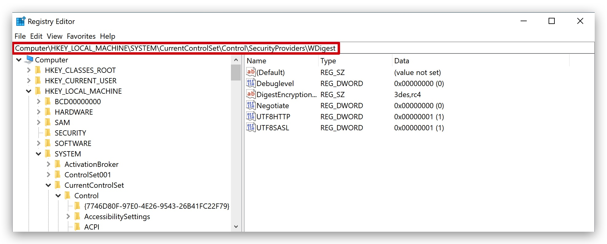
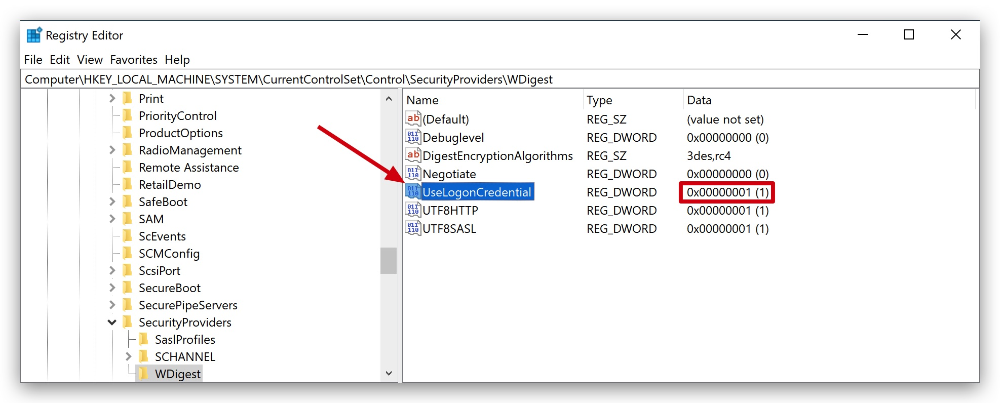
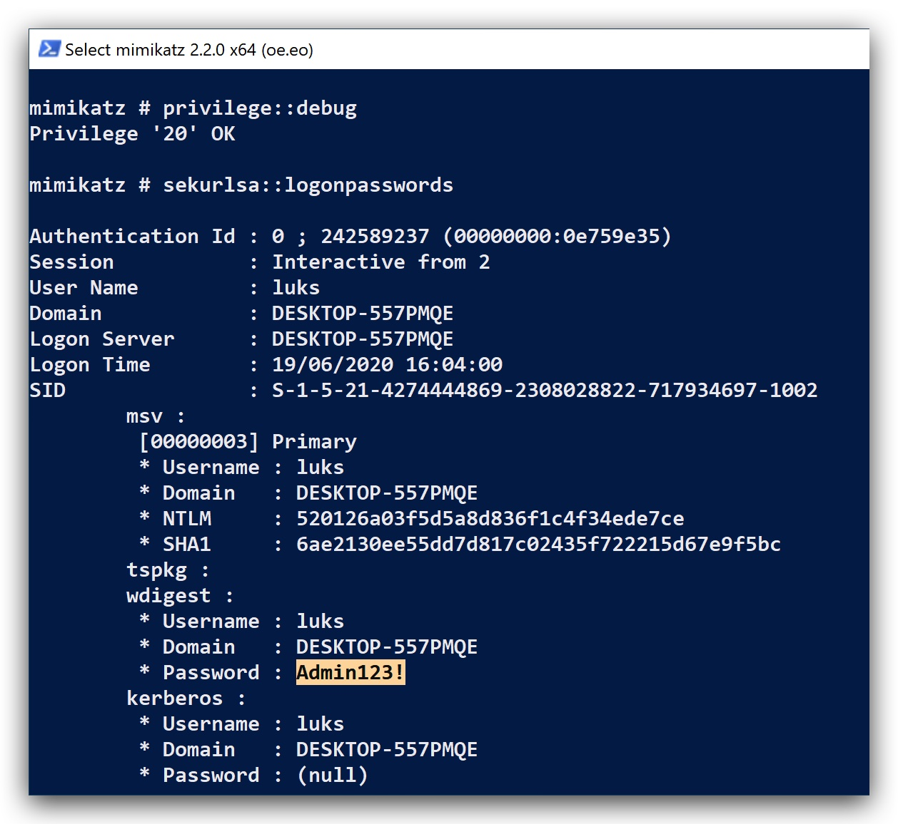

# Chapter 2.3 Credential Access

Mitre: T1003 
--
***source: https://attack.mitre.org/techniques/T1003/***

>Credential dumping is the process of obtaining account login and password information, normally in the form of a hash or a clear text password, from the operating system and software. Credentials can then be used to perform Lateral Movement and access restricted information.

- **LSASS** [Memory] : The Local Security Authority Subsystem Service (LSASS) handles the enforcement of security policy in a Windows host. In Windows environments from 2000 to Server 2008 the memory of the LSASS process was storing passwords in clear-text to support WDigest and SSP authentication. 

Credentials are stored in LSASS when:

1. a user logs on locally to the system
2. you use runas and provide credentials
3. an RDP connection is established

Microsoft from Windows 8.1 and Windows Server 2012 enhanced security by preventing LSASS from storing passwords in clear-text. However in a system that has been already compromised with elevated credentials a minor registry modification can instruct LSASS process to store clear-text passwords in its memory in the next login of the user



```code
reg add "HKEY_LOCAL_MACHINE\SYSTEM\CurrentControlSet\Control\SecurityProviders\WDigest" /v UseLogonCredential /t REG_DWORD /d 00000001 /f"
```

 

If you now run Mimikatz.exe, you'll see clear-text credentials in memory again. Even on Windows 10 - maybe that's a registry key we want to keep an eye on with Sysmon ;-) ?

 


```code
procdump.exe -accepteula -ma lsass.exe c:\windows\temp\lsass.dmp 2>&1
mimikatz.exe log "sekurlsa::minidump lsass.dmp" sekurlsa::logonPasswords exit
```

- **SAM** [Registry hive] : The SAM is a database file that contains local accounts for the host, typically those found with the ‘net user’ command. To enumerate the SAM database, ***system*** level access is required. 

- **SECURITY** [Registry hive] : 
  
- **SYSTEM** Registry hive : SysKey,to decrypt:
    -  SAM
  
- LSASecrets (https://pentestlab.blog/tag/lsa/) : registry location which contains important data that are used by the Local Security Authority like authentication, logging users on to the host, local security policy etc. This information is stored in the following registry key:
  > HKEY_LOCAL_MACHINE/Security/Policy/Secrets

```code
reg save hklm\sam c:\temp\sam.save
reg save hklm\security c:\temp\security.save
reg save hklm\system c:\temp\system.save
```

- **NTDS.dit** file : hashes of domain accounts, present on Domain Controllers. Active Directory stores information about members of the domain including devices and users to verify credentials and define access rights. The Active Directory domain database is stored in the NTDS.dit file. By default the NTDS file will be located in %SystemRoot%\NTDS\Ntds.dit of a domain controller.

PREVENTION
===

https://medium.com/blue-team/preventing-mimikatz-attacks-ed283e7ebdd5
