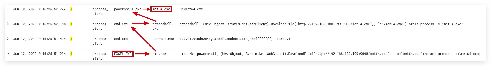

# Chapter 2.7 - Process Spawning 
>This chapter explains how to create malicious Office Macros on your `Windows 10 machine`

===

Let's start by opening powershell open your Windows 10 machine by clicking on the windows logo in the bottom left corner, and just start typing "power":


open powershell and run as ___administrator___:

1. SETUP the attack - create malicious macro and payload
===
In your labs folder you will find an excel sheet and a metasploit resouces script that will be hosting the payload (a meterpreter reversr HTTP shell)

2. EXECUTE the attack
===

3. BUILD a detection with sigma
===




```yaml
title: Microsoft Office Product Spawning Windows Shell
id: 438025f9-5856-4663-83f7-52f878a70a50
status: experimental
description: Detects a Windows command line executable started from Microsoft Word, Excel, Powerpoint, Publisher and Visio.
references:
    - https://www.hybrid-analysis.com/sample/465aabe132ccb949e75b8ab9c5bda36d80cf2fd503d52b8bad54e295f28bbc21?environmentId=100
    - https://mgreen27.github.io/posts/2018/04/02/DownloadCradle.html
tags:
    - attack.execution
    - attack.defense_evasion
    - attack.t1059
    - attack.t1202
    - car.2013-02-003
    - car.2014-04-003
author: Michael Haag, Florian Roth, Markus Neis
date: 2018/04/06
logsource:
    category: process_creation
    product: windows
detection:
    selection:
        ParentImage:
            - '*\WINWORD.EXE'
            - '*\EXCEL.EXE'
        Image:
            - '*\cmd.exe'
            - '*\powershell.exe'
    condition: selection
fields:
    - CommandLine
    - ParentCommandLine
falsepositives:
    - unknown
level: high
```

Sigma query:

```code
sigmac -Okeyword_blacklist=* -t es-qs -c /opt/sigma/tools/config/winlogbeat-modules-enabled.yml /opt/threathunt/sigma_rules/win_crimsoncore_officespawn.yaml
```

Kibana Query:
```code
(process.parent.executable:("*\\EXCEL.EXE") AND process.executable:("*\\cmd.exe"))
```

When you run this, the results will be empty - for some reason sigma is adding quotation marks and Kibana doesn't like this. So just remove the "". The resulting query should be:

Kibana Query:
```code
(process.parent.executable:(*\\EXCEL.EXE) AND process.executable:(*\\cmd.exe))
```
