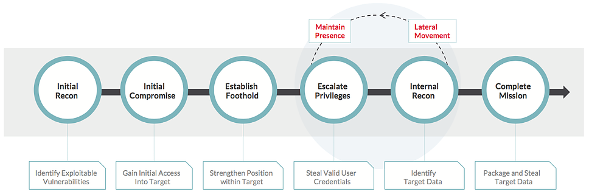
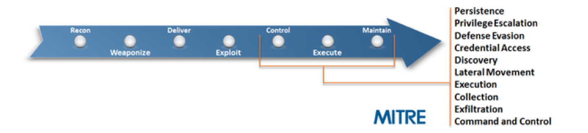

# Chapter 2 - Labs
 Welcome to the **Exclusive Networks** Threat Hunting Training, this is the official lab guide that will guide you through performing attacker TTP's, building detections, dashboards and defenses.

 >We will go through part of the kill chain, explain how the attacks work, then build detections and talk a bit about preventive measures.

We will mainly focus on attacker behaviour, POST exploitation - see what Tactics, Techniques and procedures are being used by attackers, mainly by living off the land (using tools already built-in or available within the environment).

- Recon  
- Privilege Escalation  
- Persistence  
- Lateral Movement  

