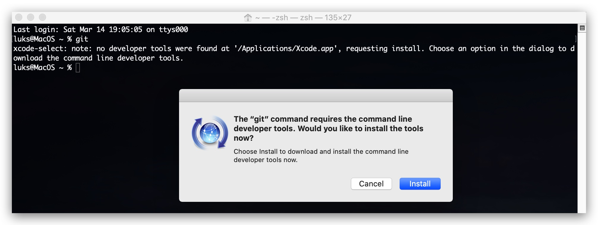
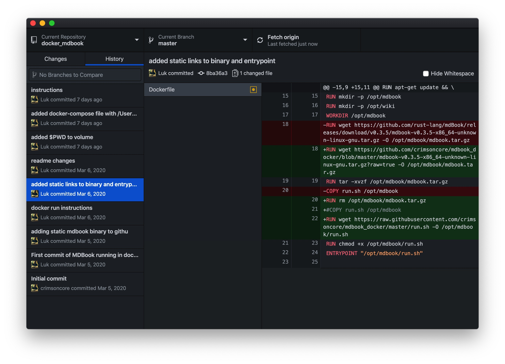

# Chapter X - Adminsitration

>This chapter explains how to set up your `MacOS` to work with the lab environment, or build your own docker images, collaborate on git code etc...

1.1 : Install git 
====

The simplest way to install git on MacOS is to open a terminal session and type "git". If git is not installed, you will be prompted to inbstall xcode (developer tools). This is not the latest version of git, but it shouldn't make a lot of difference for what we need git.



If you want the **latest** and greatest version of git there are two options. The first option is downloading the .dmg file and follow the installation instructions 

https://git-scm.com/download/mac

The second option is installing **homebrew**, which is a package manager for MacOS, the advantage here is that you can also install other packages (wget, curl, python etc) and you can just update the installed packages by typing "brew update".

```code
/bin/bash -c "$(curl -fsSL https://raw.githubusercontent.com/Homebrew/install/master/install.sh)"
```
```code
brew install git
```

    https://www.linode.com/docs/development/version-control/how-to-install-git-on-linux-mac-and-windows/

1.2 : Install git desktop (***optional***)
====

Download and install:
- https://desktop.github.com



1.3 : Install visual studio code
====

Download and install:
- https://code.visualstudio.com/download


1.4 Install docker-desktop
====

Download and install:
- https://www.docker.com/products/docker-desktop


this will install docker desktop and the command-line tools
    docker
    docker-compose

>**docker-compose --version**  
docker-compose version 1.25.4, build 8d51620a  

>**docker --version**        
Docker version 19.03.8, build afacb8b
