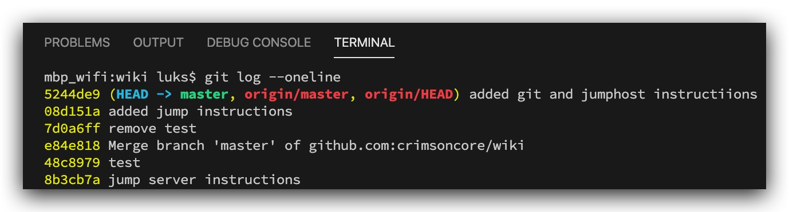

#   Chapter X.0 - Git

**1.1 - Working with branches**
----

***git status***

```code
git status
On branch master
Your branch is up to date with 'origin/master'.

Changes not staged for commit:
  (use "git add <file>..." to update what will be committed)
  (use "git checkout -- <file>..." to discard changes in working directory)

        modified:   src/X/Git.md

no changes added to commit (use "git add" and/or "git commit -a")
```

***git log --oneline***



**1.2 - Creating a new branch**
----

***git branch*** ls_feature : create a new branch

***git checkout -b*** ls_git : `create a new branch and switch to it`

***git branch -a*** : list all branches for a repository

```code
git branch -a
  ls_git
* master
  remotes/origin/HEAD -> origin/master
  remotes/origin/master
```

***git checkout*** ls_feature : move to specific branch and start coding

```code
git checkout ls_git
Switched to branch 'ls_git'
```

**Deleting a branch**
---

git branch -d ls_git  
git fetch -p

**Merging a branch**
----

git checkout master

