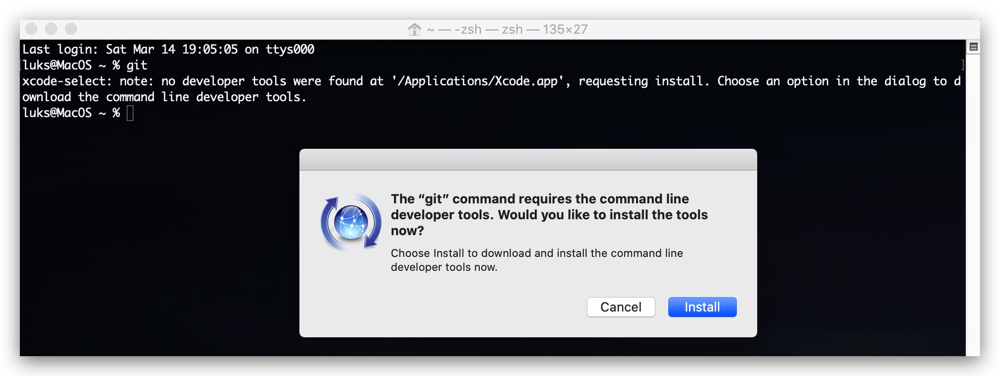

#   Chapter X.0 - Git
>This chapter explains how to install and work with git on `MacOS`, for this training your `kali kinux machine` already has git installed - so you don't need to go through the git installation. This is merely a tutorial to get you up and running with git on MacOS and work with branches - when you're going to cooperate in a team developing code.

|   |   |
|---|---|
|  | All the **Threat Hunting Academy** repositories, dockerfiles, ansible and terraform scripts can be found below. |
|   |   |

- GIT SOURCE CODE : ***[https://github.com/CrimsonCORE](https://github.com/crimsoncore)***  
- DOCKER IMAGES : ***[https://hub.docker.com/u/CrimsonCORELabs](https://hub.docker.com/u/crimsoncorelabs)***  

**1.0 : Installing Git on MACOS**
---- 

The simplest way to install git on MacOS is to open a terminal session and type "git". If git is not installed, you will be prompted to inbstall xcode (developer tools). This is not the latest version of git, but it shouldn't make a lot of difference for what we need git.



If you want the **latest** and greatest version of git there are two options. The first option is downloading the .dmg file and follow the installation instructions 

https://git-scm.com/download/mac

The second option is installing **homebrew**, which is a package manager for MacOS, the advantage here is that you can also install other packages (wget, curl, python etc) and you can just update the installed packages by typing "brew update".

```code
/bin/bash -c "$(curl -fsSL https://raw.githubusercontent.com/Homebrew/install/master/install.sh)"
```
```code
brew install git
```

    https://www.linode.com/docs/development/version-control/how-to-install-git-on-linux-mac-and-windows/

A very good tutorial to get started with git can be found here on [YouTube](https://www.youtube.com/watch?v=3RjQznt-8kE&list=PL4cUxeGkcC9goXbgTDQ0n_4TBzOO0ocPR).

**1.1 : Working with branches**
----

***git status***

```code
git status
On branch master
Your branch is up to date with 'origin/master'.

Changes not staged for commit:
  (use "git add <file>..." to update what will be committed)
  (use "git checkout -- <file>..." to discard changes in working directory)

        modified:   src/X/Git.md

no changes added to commit (use "git add" and/or "git commit -a")
```

***git log --oneline***


**1.2 - Creating a new branch**
----

***git branch*** ls_feature : create a new branch

***git checkout -b*** ls_git : `create a new branch and switch to it`

***git branch -a*** : list all branches for a repository

```code
git branch -a
  ls_git
* master
  remotes/origin/HEAD -> origin/master
  remotes/origin/master
```

***git checkout*** ls_feature : move to specific branch and start coding

```code
git checkout ls_git
Switched to branch 'ls_git'
```

**Deleting a branch**
---

git branch -d ls_git  
git fetch -p

**Merging a branch**
----

git checkout master

