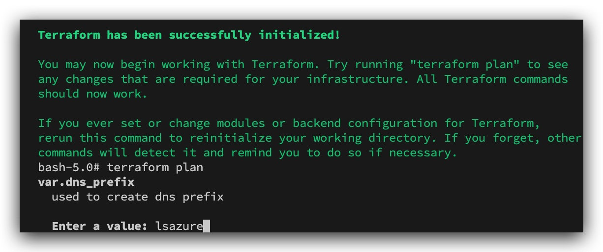

# Chapter X.1 - Terraform

On your windows/mac machine install

  - `Visual Studio Code (VSC)`
  - https://code.visualstudio.com/#alt-downloads
  
```code
cd /opt
git clone https://gitlab.com/Schoonaert/threathuntterraform.git
```

Open this folder in `VSC`, it will prompt you to open it again but as a container. Then in the terminal at the bottom login to you Azure instance with your credentials:

```code
az login
```


Since we are deploying some images from the azure market place, we need to accept the EULA before kicking off the scripts. In your DEV container in Visual Studio Code, type the following in the terminal at the bottom:

```code
az vm image terms accept --urn kali-linux:kali-linux:kali:2019.2.0
```


```code
terraform init
terraform plan
```
>use a `unique` prefix, in the example we're using "lsazure", this will be used to assign FQDN names for the virtual machines public IP addresses. So pick your own unique identifier, don't use the one in this example or stuff will break :).



```code
sudo terraform apply
```

>Enter the same `unique` prefix that you entered during the plan phase. And let terraform do its thing, this might take 10-15min. Don't close your `VSC` until the script has finished. ***Don't forget to type 'yes' after the scripted has kicked off***, you can ignore any of the yellow warning messages.


If you haven't changed any values (vmcount=1) in the terraform 'main.tf' file the network that has been deployed in Azure will look like this:


Centralized Lab Infrastructure
====


DOMAIN CONTROLLER
----

>**Windows 2019 Server - DC**  
Internal Hostname: dc01.acme.local  
Internal IP : 10.0.0.4/24   
AD domain name : acme.local    
Username : thadmin@acme.local    
Password : Password1234!  
Public Hostname: dc01-`lsazure`.westeurope.cloudapp.azure.com   
Publicly exposed services - RDP

ELK SERVER
----

>**Ubuntu 16.04 - ELK**  
Internal IP : 10.0.0.5/24    
Username : thadmin   
Password : Password1234!  
Public Hostname: az-elk-`lsazure`.westeurope.cloudapp.azure.com  
Publicly exposed services - 

RABBITMQ / GUACAMOLE SERVER
----

>**Ubuntu 16.04 - RabbitMQ/Guacamole**  
IP : 10.0.0.5/24   
domain name : acme.local    
Username : thadmin   
Password : Password1234!  
Public Hostname: az-mq-`lsazure`.westeurope.cloudapp.azure.com  

`For class teachers only : The RabbitMQ server can be accessed through SSH with the command below.` Students should not SSH into this server as it's part of the shared classroom infrastructure.

```code
ssh thadmin@az-mq-lsazure.westeurope.cloudapp.azure.com
```

The ***RabbitMQ / Guacamole*** server serves multiple purposes, it runs a webserver on port 8080 for Guacamole, which is an Remote Desktop (RDP) jump host over HTTP. This way ***students*** don't need to install client software in order to access their Windows 10 machine.

COPY/PASTE with guacamole : https://community.microstrategy.com/s/article/How-to-Use-Guacamole-to-Copy-and-Paste-Text-or-File-in-MicroStrategy-on-AWS?language=en_US

```code
http://az-mq-lsazure.westeurope.cloudapp.azure.com:8080/guacamole/
```

**Guacamole Username : thadmin**  
**Guacamole Password : Password1234!**


This system is also running ***RabbitMQ*** which is a message queue that is used in this class to collect all the students winlogbeat logs, through a logstash instance.

- logstash listens on **TCP 5044**
- RabbitMQ listens on **TCP 5672**

The RabbitMQ Management interface listens on 

Individual Student Machines
====
