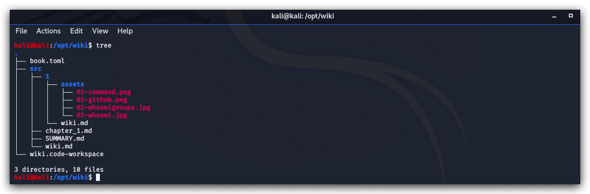

CHAPTER 0: Threat Hunting Lab - MDBOOK and Wiki Instructions
====

This chapter explains how to install the Threat Hunting WIKI and Labs guide>

> On you kali linux machine open a terminal. Use SSH and login with your student-id and password (student01/student01)

```yml
 ssh studentxx@yourkalimachine
 cd /opt
 git clone https://github.com/crimsoncore/wiki.git
```
You should see the following structure:



> Install mdbook (if you want to run this locally on your server) - in the Lab environment you can simple connect to the ELK server (10.0.0.5) on port 3000.
> 
```yml
cd /opt
sudo docker run -it -name mdbook -v /opt/wiki:/opt/wiki -p 3000:3000 -p 3001:3001 lschoonaert/mdbook
```
MDbook will automatically monitor for new updates, so you can pull down new versions of the documentation whenever available:

```yml
cd /opt/wiki
sudo git pull
```
