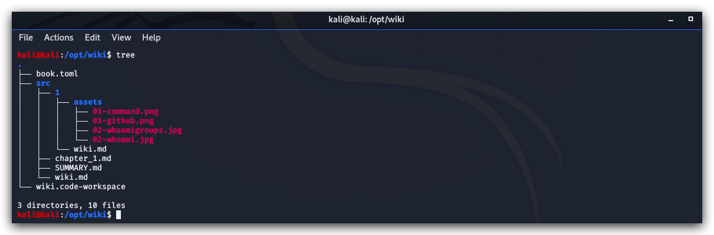
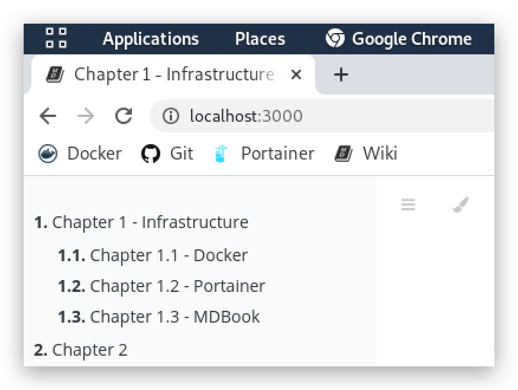
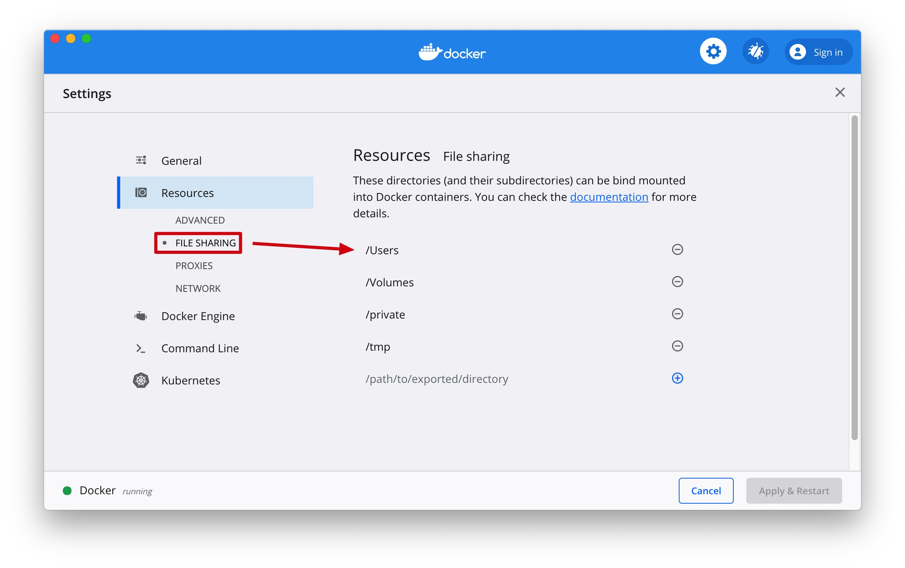

CHAPTER 1.3: Installing MDBOOK and Wiki Instructions
====

>This chapter explains how to install the Threat Hunting WIKI and Labs guide

On your kali linux machine open a terminal. Use SSH and login with your kali username and password (***kali/kali***). First we're going to clone the MarkDown files from the wiki to our local machine> Then we'll clone the ThreatHunt github repository that contains all the labs and docker containers.

***Source: https://github.com/rust-lang/mdBook***

```code
 ssh kali@yourkalimachine
``` 

 ```code
 cd /opt
 sudo git clone https://github.com/crimsoncore/wiki.git
 sudo git clone https://gitlab.com/Schoonaert/threathunt.git
```
You should see the following structure for the MarkDown files:



Install **mdbook** (if you want to run this locally on your Kali machine) - in the Lab environment you can simple connect to the ELK server (10.0.0.5) on port 3000, as we have already pre-installed this.



Navigate to the folder where you cloned the wiki.git repository, in the example above this is the /opt/wiki directory ($PWD)

```code
cd /opt/wiki
sudo docker run -it --name mdbook -v $PWD:/opt/wiki -p 3000:3000 -p 3001:3001 crimsoncorelabs/mdbook
```

> If you're doing this on MacOS it's better to clone the repo to a default shared directory by your docker-desktop client. The __"/opt" directory__ is not supported on a Mac, so it's better to do this from your ?/Users/youruser (or ~ home directory).



MDbook will automatically monitor for new updates, so you can pull down new versions of the documentation whenever available:

```code
cd /opt/wiki
sudo git pull
```

> We also provided docker compose files, which you can find in the /opt/threathunt/docker-compose directory. You can install docker compose files like this (make sure you run this command from ***the directory your wiki is cloned*** into i.e. /Users/Student01/wiki or /opt/wiki):

```code
cd /opt/wiki
sudo docker-compose -f /opt/threathunt/docker-compose/docker-compose.mdbook.yml up -d
```
- -f : the name of the docker-compose name
- -d : run in daemon mode

**Source: /opt/threathunt/docker-compose/dc.mdbook.yml**
```yml
version: '2'
services:
  mdbook:
    image: crimsoncorelabs/mdbook
    container_name: mdbook
    restart: unless-stopped
    volumes:
    - $PWD:/opt/wiki
    ports:
      - 3000:3000
    networks:
      - elastic
networks:
  elastic:
    driver: bridge
```