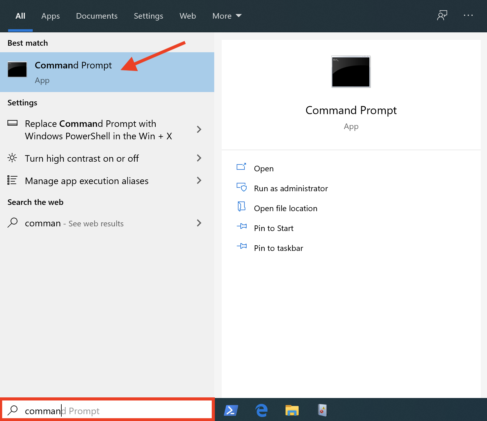
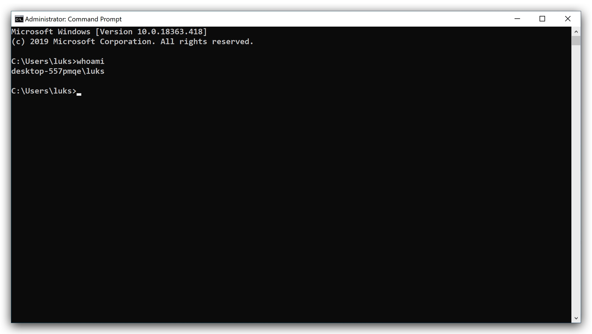
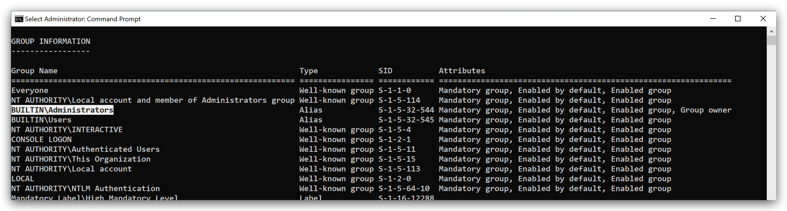

Threat Hunting Lab 1
====
Recon
------
The following lab will show how to perform recon by living off the land - using native windows tools and commands to get some situational awareness.

- net commands
- powershell commands
- wmic (Windows Management instrumentation)

> It is impossible to block this kind of activity, since these are valid windows commands. It is however unusual for regular users to perform these commands. 

On your windows machine, open a command prompt and type the following commands. Please note that he actual output will probably be different for your windows machine and user name.



```yml
 whoami
```



```yml
 whoami /groups
```



 /root/sec699-lab/mdbook serve -n 0.0.0.0 /root/sec699-lab/wiki/


